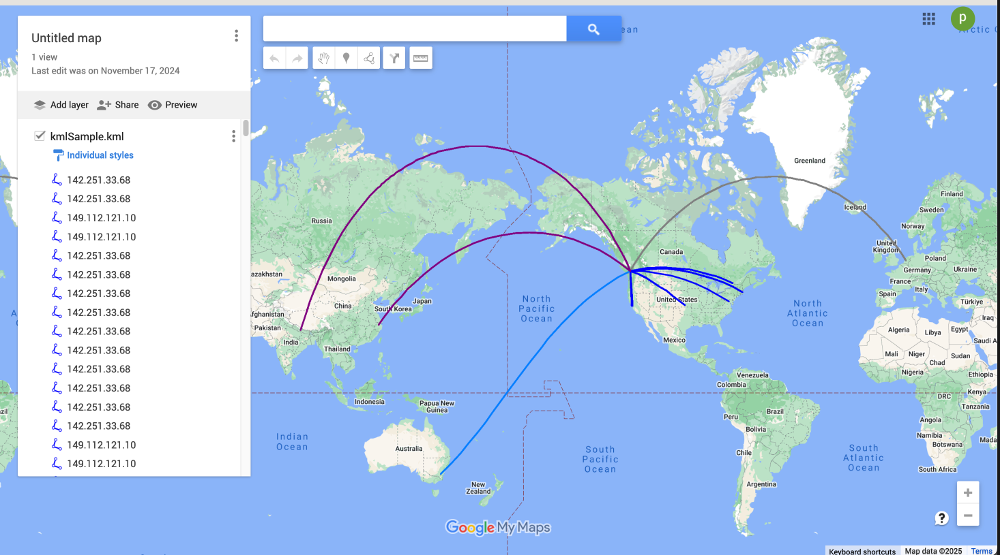
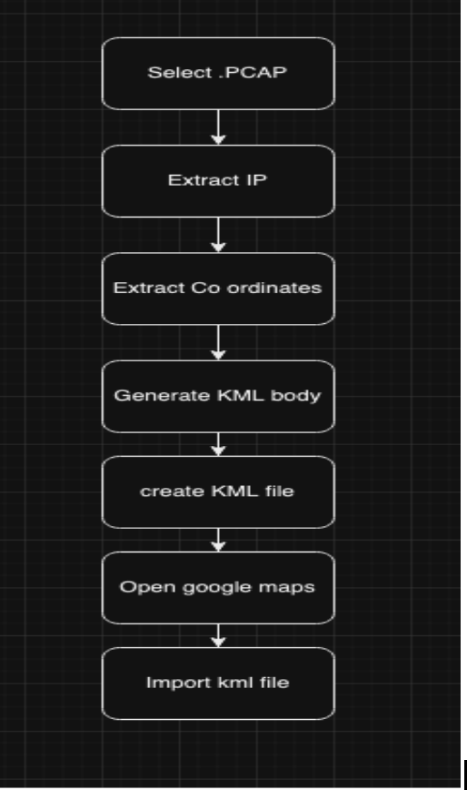

## Introduction
Network traffic analysis plays a critical role in identifying security breaches, investigating incidents, and ensuring network integrity. Tools like Wireshark are widely used for capturing and analyzing network packets. However, these tools often provide raw, unstructured data that can be difficult for analysts to interpret efficiently. By mapping this data to geographical locations and visualizing the traffic flow, the tool aims to provide a more intuitive and actionable insight into network activities. The purpose of this project is to develop a network traffic visualization tool that integrates Wireshark for packet capture, Python for data processing, and Google Maps for visualization. This tool aims to assist network analysts, forensic experts, and incident responders by automating the process of tracing and mapping source and destination IP addresses from .PCAP files, ultimately enhancing their ability to visualize and analyze network traffic flows. I had a chance to use this similar tool in Splunk SIEM during my Cybersecurity exams, where it saved me tons of time to pinpoint geographical location from a .pcap file.
The key objectives of this tool include:
Visualizing Network Traffic: The tool will trace and map source and destination IP addresses from .PCAP files, allowing analysts to see how data moves across the network and identify traffic patterns.
Automating Geo-Location Mapping: By integrating the GeoLiteCity database, the tool will automatically fetch the geographical locations of source and destination IPs, visually displaying these locations on Google Maps. This feature enables analysts to map traffic flows geographically, helping to identify abnormal or suspicious connections based on location.
Generating Insights: The tool will be capable of detecting and highlighting external traffic, such as connections from outside the U.S. or other expected regions, to assist in network monitoring, anomaly detection, and geographic analysis. This helps to pinpoint potentially unauthorized access or malicious activity.
Providing Easy Integration: the tool will export the processed geolocation data in KML (Keyhole Markup Language) format, which can then be seamlessly used with visualization platforms like Google Maps for further analysis and reporting.
By providing a comprehensive visualization of network traffic and its geographical context, this tool will support more efficient investigations, enhance threat detection capabilities, and enable real-time monitoring for security professionals.

## Literature Review

Recent research on network traffic visualization and geolocation services emphasizes the importance of integrated solutions for enhanced threat detection and response. A notable study, "Network Traffic Virtualization Using Wireshark and Google Maps" (2023), highlights the integration of Wireshark for packet capture, the GeoIP library, and the GeoLiteCity database for mapping IP addresses to their geographical locations. The final output is visualized on Google Maps. This approach lays the foundation for the current project, which aims to improve upon this method by enabling the analysis of multiple .PCAP files and providing real-time visualization of IP traffic flows. By offering enhanced user experience and simplifying anomaly detection, this project seeks to refine the existing framework.
However, some challenges persist in the current solutions:
Time-Consuming Process: In the existing method, after the KML file is generated through the Python script, the user must print the output in the terminal, copy it, paste it into Notepad++, save it with a .kml extension, and then manually upload it to Google Maps. This manual and multi-step process is time-consuming and inefficient, especially when dealing with large .PCAP datasets.
Single Color Coding for IPs: The existing approach uses a single color for all IP addresses, which can make it difficult for analysts to distinguish between different traffic types or identify malicious connections. A more nuanced color-coding system, based on factors like traffic origin, destination, or suspicious behavior, would improve visualization and make it easier to spot anomalies.
This project aims to address these challenges by automating the process of generating and visualizing KML files, reducing manual effort, and implementing a multi-color coding system to enhance the distinction between various traffic sources. The tool will also support the analysis of multiple .PCAP files and allow for real-time network traffic visualization, providing a more efficient and effective solution for network traffic monitoring and threat detection.

## Methodology

To complete this project, I employed a systematic approach to ensure all components are integrated effectively, meeting the project goals. The methodology is outlined below, detailing the steps and tools that was used to achieve the desired outcomes:
1. Research and Understanding
Research how to process a .PCAP file using Python

2. Setup Development Environment
Setup VSCode: I set up a Python IDE ( VSCode) to write, test, and debug the code effectively.
Install and configure Wireshark for packet capture: I configured wireshark to capture live network traffic on my machine. This will be used to create .PCAP files that will be processed in the tool.
Downloaded necessary Python libraries: The required libraries such as Scapy, PyGeoIP, webbrowser, easyGUI, were installed in vscode with following command:
Pip install scapy
Pip install pygeoip
Pip install easygui

3. Packet Capture
Capture packets using Wireshark: I used Wireshark to capture live network traffic on my machine, ensuring I obtain .PCAP files that contain data to be processed.

4. Data Processing and Geolocation Mapping
Write Python code: I wrote Python scripts to extract source and destination IP addresses from the .PCAP files using the Scapy libraries.
Integrate GeoLiteCity database: The GeoLiteCity database was used in conjunction with PyGeoIP to map the extracted IP addresses to geographic locations. This will allow for accurate plotting of the IP traffic on a map.

5. Network Traffic Visualization
Plot network traffic on Google Maps: The IPs and their geographic locations were visualized on Google Maps using KML (Keyhole Markup Language) files, which can be easily uploaded to Google Maps.
Mark source and destination IPs: Markers was used to highlight the source and destination IPs on the map. Suspicious or malicious IPs will be clearly indicated.

6. Color-Coding for Distinction
Color-code malicious or suspicious IPs: Malicious or suspicious IPs were color-coded differently to help analysts easily distinguish them from non-malicious traffic. This enhances the ability to identify threats quickly based on geographic location and other characteristics.

7. Testing and Validation
Test the functionality: To ensure the tool is functioning as intended, I validated it by processing live packets from my computer, as well as online .PCAP files. Testing ensured that the software can handle different types of network traffic, generate accurate geolocation data, and visualize it effectively on Google Maps.

## Tools Used:

1. Wireshark: Used for capturing live network packets.
VSCode: Python IDE that will facilitate coding, testing, and debugging the tool.

2. GeoLiteCity Database: Provides geolocation data for IP addresses, allowing for accurate mapping of source and destination IPs.
Google Maps: Visualization platform for plotting traffic data and geographic locations.

3. Python Libraries:
- Scapy: For analyzing .PCAP files and extracting packet details such as source and destination IPs.
- PyGeoIP: To map IP addresses to geographic coordinates using the GeoLiteCity database.
- WebBrowser: To open Google Maps directly from the Python application.
- EasyGUI: To facilitate file selection for users when uploading .PCAP files.

## Results and Discussion

The project successfully mapped source and destination IP addresses onto Google Maps, using real-time processing and geolocation services. IP addresses were color-coded by continent, providing an easy way to identify anomalies and potential threats. The integration of the GeoIP library and GeoLiteCity database resulted in accurate geolocation, and the tool was capable of processing diverse .PCAP datasets. There were some inaccuracies with IPs from VPN services and cloud providers (e.g., AWS or Google Cloud), where the tool would return a generic location or proxy-based geolocation. This was expected as the GeoLiteCity database may not always reflect the true physical locations of VPNs or proxies. 
Some of the unexpected Findings and Challenges were that the GeoLiteCity.dat database worked well for most IPs but struggled with VPN, proxy, and cloud-based IPs. Performance issues arose when handling large .pcap files, with slower processing times and occasional memory problems, which could be addressed through packet sampling or multi-threaded processing. The tool also faced difficulties geolocating private or local IPs (e.g., 192.168.x.x), which lack public geolocation data. Additionally, integrating the tool with external threat intelligence feeds proved challenging, as real-time data on malicious IPs and mapping it to traffic would require additional APIs or data sources, increasing system complexity.

{: width="972" height="589" }

{: width="972" height="589" }

Above is the overall flow of how the program works

## Conclusions and Recommendations

The project successfully achieved its goal of creating a network traffic visualization tool that maps IP addresses and identifies threats based on geolocation. Integrating Wireshark, Python, and Google Maps provided an effective solution for visualizing traffic flows and simplifying network analysis.
Key enhancements included:
- Interactive IP Identification: Clicking lines on Google Maps reveals associated IP names.
- IP Address Flagging: Highlights specific IPs for quick analysis.
- Out-of-Country Notifications: Alerts when non-US IPs are detected.
- Streamlined Processes: Time-saving optimizations reduced manual work.

Future Recommendations
- Support for Non-IP Traffic: Expand analysis to other network identifiers.
- Advanced Detection: Integrate AI for identifying threat patterns.
- Real-Time Alerts: Add notifications for suspicious activities.
- Improved Geolocation: Upgrade databases for better accuracy.
- Scalability: Optimize performance for large datasets.
- Threat Intelligence: Incorporate feeds for enriched IP insights.
- Enhanced Visualization: Include traffic types, latency, and timeline playback.

These improvements will make the tool more powerful and versatile, catering to evolving cybersecurity needs.

## References

- "Network Traffic Virtualization Using Wireshark and Google Maps" – S. Arvind, et al., 2023.IEEE DOI: 10.1109/ICDCECE57866.2023.10150823

- https://developers.google.com/kml/documentation

