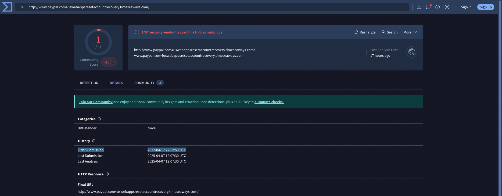

## Tools Required:
- Tshark
- VirusTotal


## Task 2:

### 1) What is the full URL of the malicious/suspicious domain address?

To identify the full URL of the malicious or suspicious domain address, we first navigate to the `/desktop/exercise-files` directory, where the `.pcap` file is located. This file contains the captured network traffic data that we need to analyze.
Next, we execute this command in the terminal:

```bash
tshark -r teamwork.pcap -T fields -e http.host | sort | uniq
```

This command uses TShark, a network protocol analyzer, to read the `teamwork.pcap` file. The `-T fields` option specifies that we want to extract specific fields from the packet data, and `-e http.host` indicates that we are interested in the HTTP host field. The `sort | uniq` part of the command sorts the output and removes duplicate entries, providing us with a unique list of HTTP hosts found in the capture file.

#### Following is the output of the query:
```bash
ubuntu@ip-10-10-13-9:~/Desktop/exercise-files$ tshark -r teamwork.pcap -T fields -e http.host | sort | uniq

toolbarqueries.google.com
www.paypal.com4uswebappsresetaccountrecovery.timeseaways.com
```

The host `https://www.paypal.com4uswebappsresetaccountrecovery.timeseaways.com/`. If we look up this URL in VirusTotal it is flagged for phishing. It is crucial to note that this URL mimics a legitimate PayPal address but includes additional, suspicious elements that indicate it is likely used for phishing or other malicious activities.

#### Answer in Defanged Format:
hxxp[://]www[.]paypal[.]com4uswebappsresetaccountrecovery[.]timeseaways[.]com/

---

### 2) When was the URL of the malicious/suspicious domain address first submitted to VirusTotal?

(Use VirusTotal to lookup the submission date under details)

Answer: 2017-04-17 22:52:53 UTC



---

### 3) Which known service was the domain trying to impersonate?

Answer: PayPal

---

### 4) What is the IP address of the malicious domain?

To determine the IP address of the malicious domain, we start by executing the command:

```bash
tshark -r teamwork.pcap -T fields -e dns.qry.name -e dns.a | sort -u
```

This command reads the packet capture file `teamwork.pcap` and extracts DNS query names and their corresponding IP addresses. By using the `sort -u` option, we ensure that the output is sorted and unique, eliminating any duplicate entries.

#### Output:
```bash
ubuntu@ip-10-10-136-142:~/Desktop/exercise-files$ tshark -r teamwork.pcap -T fields -e dns.qry.name -e dns.a | sort -u

toolbarqueries.google.com
toolbarqueries.google.com 172.217.7.228
toolbarqueries.google.com 216.58.217.100
wittyserver
wittyserver.hsd1.md.comcast.net
www.paypal.com4uswebappsresetaccountrecovery.timeseaways.com
www.paypal.com4uswebappsresetaccountrecovery.timeseaways.com 184.154.127.226
```

#### Answer from shell line 9: 
184[.]154[.]127[.]226

---

### 5) What is the email address that was used?

To determine the email address used in the packet capture file, we execute the command:

```bash
tshark -r teamwork.pcap -V | grep -Eo '[a-zA-Z0-9._%+-]+@[a-zA-Z0-9.-]+\.[a-zA-Z]{2,}'
```

This command reads the packet capture file `teamwork.pcap` and displays detailed information about each packet. The `-r` option specifies the file to read from, and the `-V` option provides a verbose output, showing all the details of each packet. We then pipe this output to `grep`, which uses a regular expression to search for and extract email addresses from the detailed packet information.

#### Output:
```bash
ubuntu@ip-10-10-136-142:~/Desktop/exercise-files$ tshark -r teamwork.pcap -V | grep -Eo '[a-zA-Z0-9._%+-]+@[a-zA-Z0-9.-]+\.[a-zA-Z]{2,}'

.@..zv
0@qN-.....iT
johnny5alive@gmail.com
johnny5alive@gmail.com
...h.@D..6.NUQ
....@9..Dt
....@...R.P.bu
......@.....pp
...@A....TQ
..@.1...rH
...@.l....nj
.jJ.@..jp
v..K.M@....Ld
T.W.@........ui
```

#### Answer from shell 5:
johnny5alive[at]gmail[.]com
