# Email Analysis Case Report

## Case Creation and Monitoring

- **Type of Alert:** Exchange  
- **Alert Generated On:** May 13, 2024, 09:22 AM  
- **Email SMTP Address:** 103.80.134.63  
- **Source Address:** free@coffeeshooop.com  
- **Destination Address:** felix@letsdefend.io  

---

## Email Investigation Steps
 Lets start analysis by creating a case for this event.

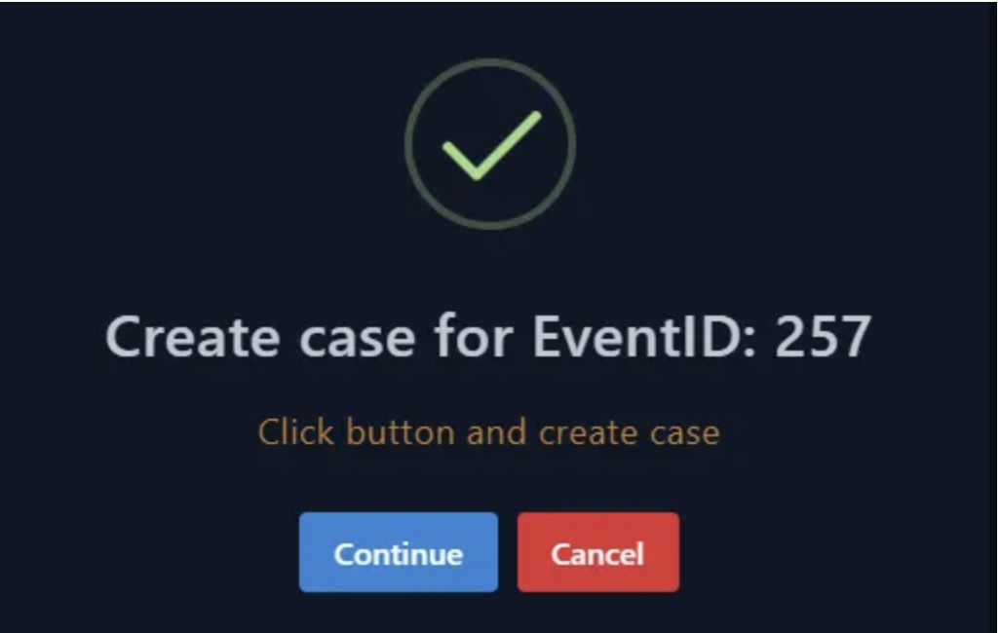{: width="972" height="589" }

---

### 1. Start the Playbook
- Clicked **‘Start the Playbook!’** to initiate the case investigation.  
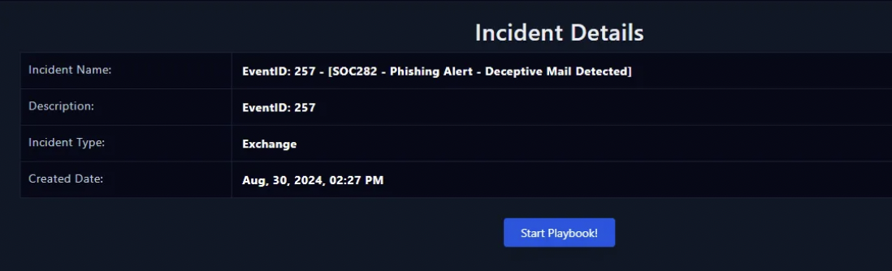{: width="972" height="589" }

---

### 2. Parse the Email
-  The first step is to Parse the email and write down the answers to these questions in a notepad or paper for furture reference and answers.
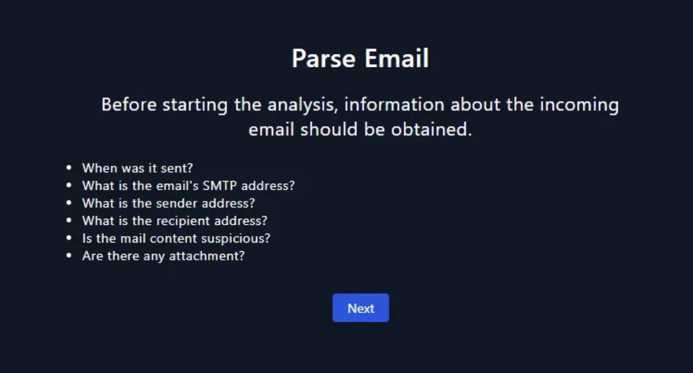{: width="972" height="589" }

---

 
{: width="972" height="589" }
### 3. Attachment in email
To answer this, open LetsDefend in another tab and move to ‘Monitoring->Investigation Channel’

---

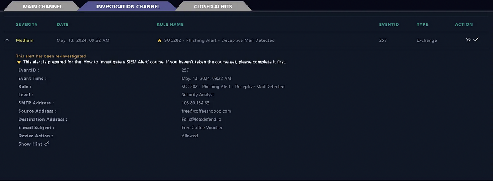{: width="972" height="589" }

### 4. Use source/destination address to search
 Now use the source address/destination address/E-mail Subject to find this email in the ‘Email Security’ section.

---

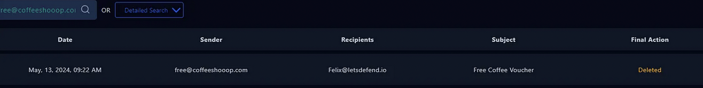{: width="972" height="589" }
### 5. Used soruce address
 I used the ‘source address’ to find the email. Lets open it to see if it contains any attachment.

---
 
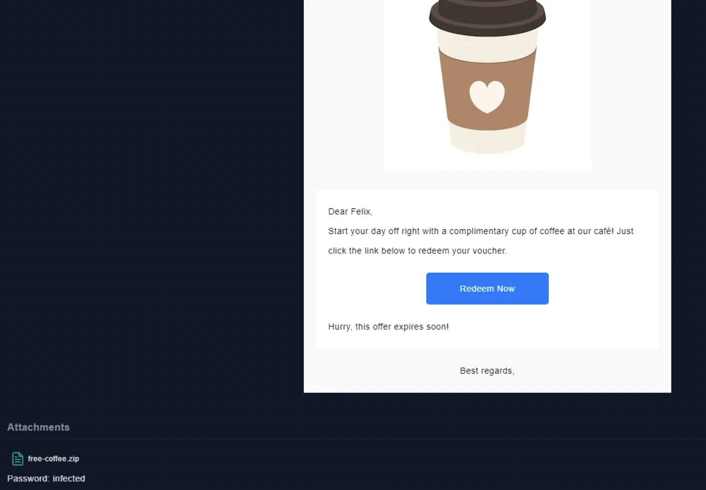{: width="972" height="589" }
 Yes, it does contain an attachment named ‘free-coffee.zip’ and the password is ‘infected’

---

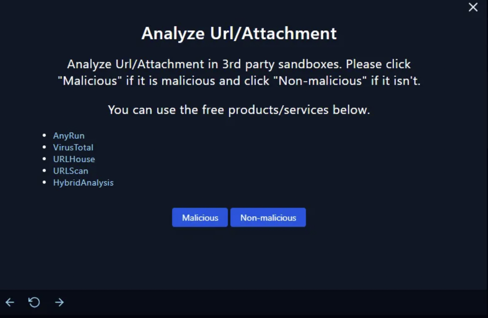{: width="972" height="589" }
 Now we got to analyze the attachment by uploading it on any of the above mentioned free services to check if its malicious or not. So first download the attachment in your VM

---

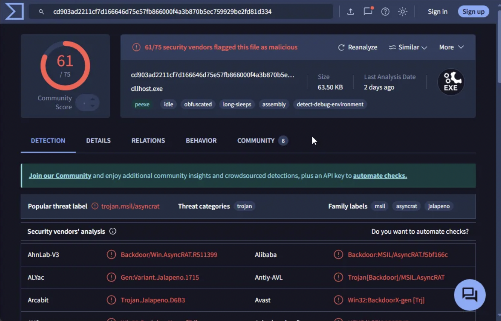{: width="972" height="589" }
I uploaded the attachment file on the Virustotal and 61 out of 75 security vendors flagged it as malicious (Backdoor).

---

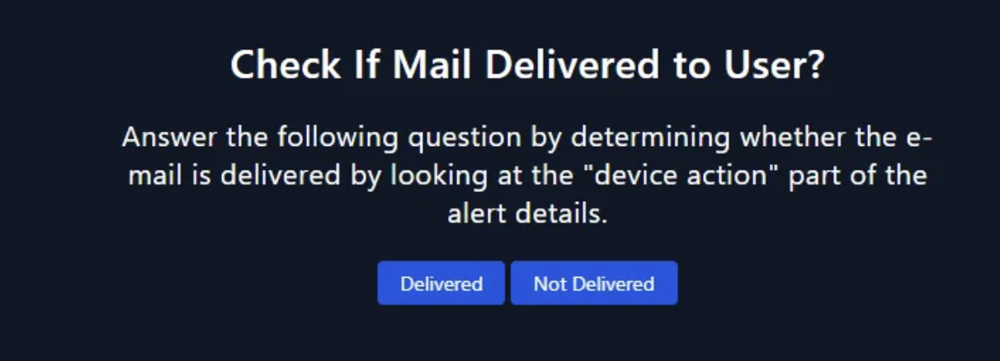{: width="972" height="589" }
To check if the mail was delivered to the user or not by opening the ‘Monitoring->Investigation Channel’ and looking at the ‘device action’ part.

---

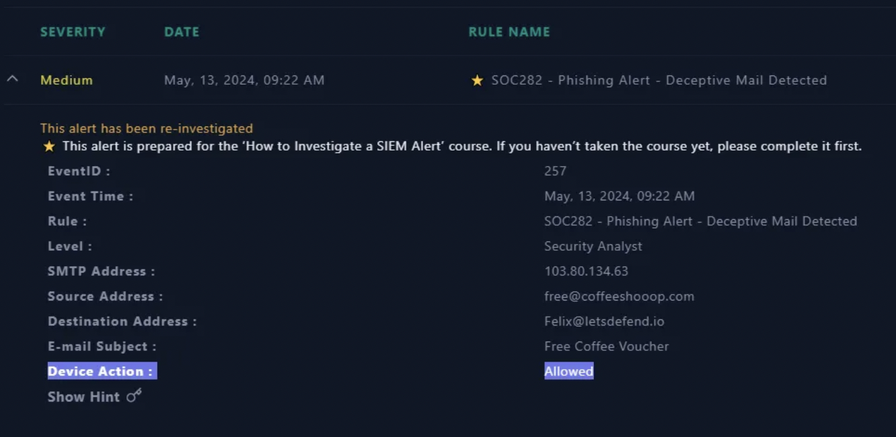{: width="972" height="589" }
It says ‘allowed’ that means positive, it was delivered to the user.

---

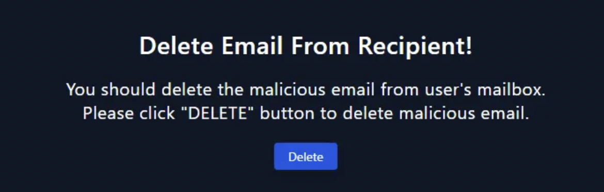{: width="972" height="589" }
 As per the playbook we have to delete the email from the user’s inbox by going to ‘Email Security’ tab and clicking the ‘Delete’ button.

---

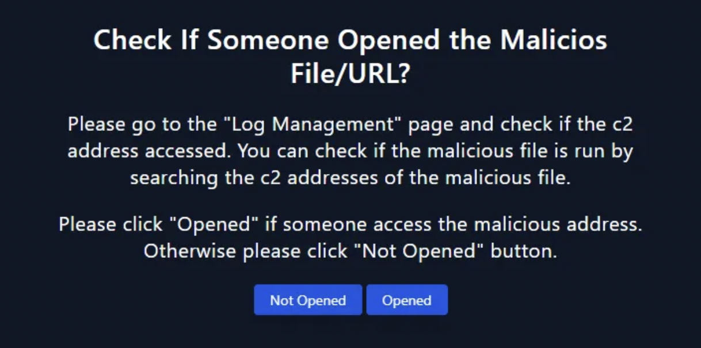{: width="972" height="589" }
Next step is to check if someone opened that attachment or not?

---
  
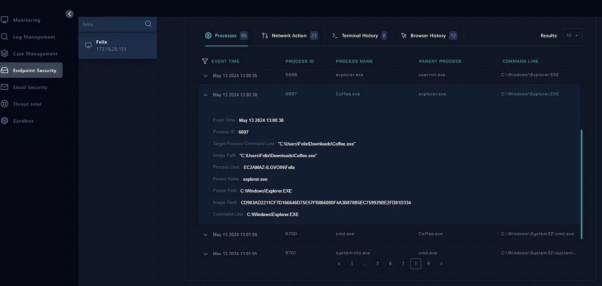{: width="972" height="589" }
 So, I went to ‘Endpoint Security’ and search for ‘Felix’ the user who received the email. I checked the processes and found out ‘Coffee.exe’ process and it was the same executable that was inside the attachment.

---

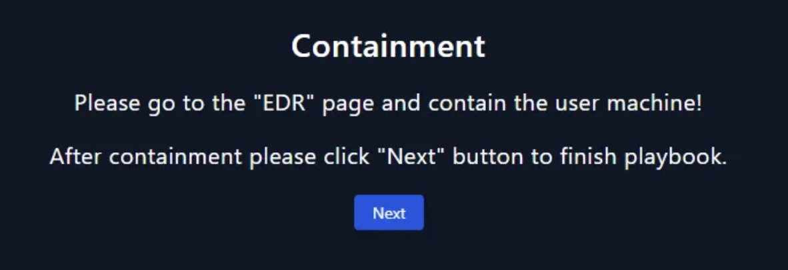{: width="972" height="589" }
Since, the user executed the malicious file that means the system has been infected and now the very first step is to isolate/contain the user so that it doesn’t spread to other users/systems.

---

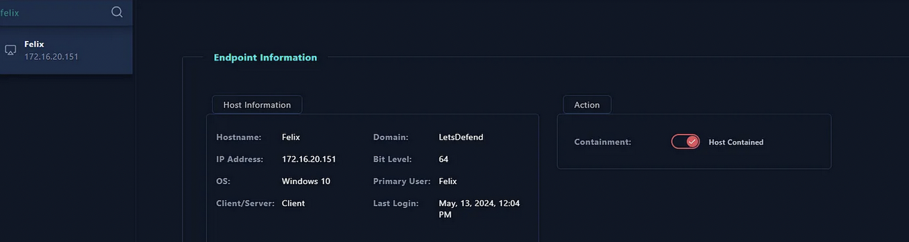{: width="972" height="589" }

 From the same ‘Endpoint Security’ page from where I checked its process, now I have contained the user. 
---

## Comments and Artifacts

| Artifact Type        | Details                           |
|----------------------|-----------------------------------|
| Source Email         | free@coffeeshooop.com             |
| Destination Email    | felix@letsdefend.io               |
| Attachment Name      | free-coffee.zip                   |
| Attachment Password  | infected                          |
| Malicious Executable | Coffee.exe                        |
| VirusTotal Result    | 61/75 flagged as malicious        |
| SMTP IP Address      | 103.80.134.63                     |
| Affected User        | Felix                             |
| Action Taken         | Email Deleted, User Contained     |

---

**Case Status:** Closed  
**Analyst:** Prabin Shrestha

### Final Comments:
The user received and executed a malicious email attachment (`Backdoor`). Immediate response actions were taken to:
- Remove the email from inbox
- Confirm execution
- Isolate the infected host

This incident highlights the importance of continuous user awareness and endpoint monitoring.

---

### Artifacts:

| Artifact Type        | Details                           |
|----------------------|-----------------------------------|
| Source Email         | free@coffeeshooop.com             |
| Destination Email    | felix@letsdefend.io               |
| Attachment Name      | free-coffee.zip                   |
| Attachment Password  | infected                          |
| Malicious Executable | Coffee.exe                        |
| VirusTotal Result    | 61/75 flagged as malicious        |
| SMTP IP Address      | 103.80.134.63                     |
| Affected User        | Felix                             |
| Action Taken         | Email Deleted, User Contained     |

---

**Case Status:** Closed  
**Analyst:** _(Your Name)_
