# Scenario:
Our web server has been compromised, and it's up to you to investigate the breach. Dive into the system, analyze logs, dissect network traffic, and uncover clues to identify the attacker and determine the extent of the damage. Are you up for the challenge?
- File Location: /root/Desktop/ChallengeFile/BruteForce.7z
- File Password: infected
- Challenge Link: https://app.letsdefend.io/challenge/brute-force-attacks

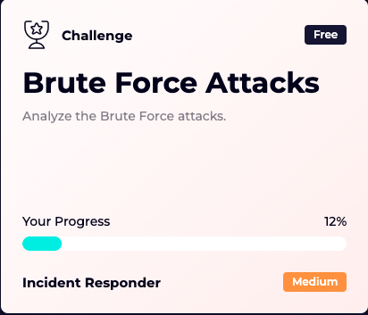{: width="972" height="589" }

---

# Tools used:
- wireshark
- Text Editor

---
# Questions:
### 1.What is the IP address of the server targeted by the attacker's brute-force attack? 
→ Extract the bruteforce.7z by navigating Desktop -> challengefile. Then we see two files
- BruteForce.pcap
- auth.log

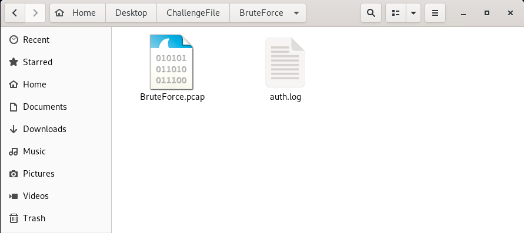{: width="972" height="589" }

Then, Open bruteforce.pcap. Check the endpoint traffic by clicking on on statistics from top navbar of wireshark -> Endpoint -> Ipv4.

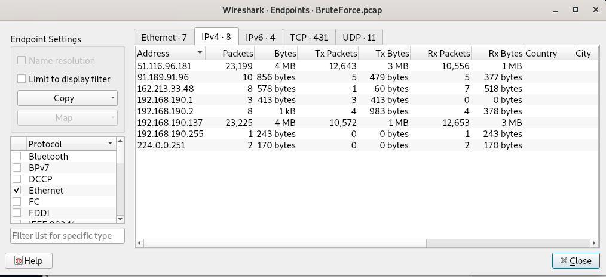{: width="972" height="589" }
We see one endpoint with higher traffic so use that ip.

- Answer: 51.116.96.181

---

### 2. Which directory was targeted by the attacker's brute-force attempt?
→ Use http filter to see the http requests.

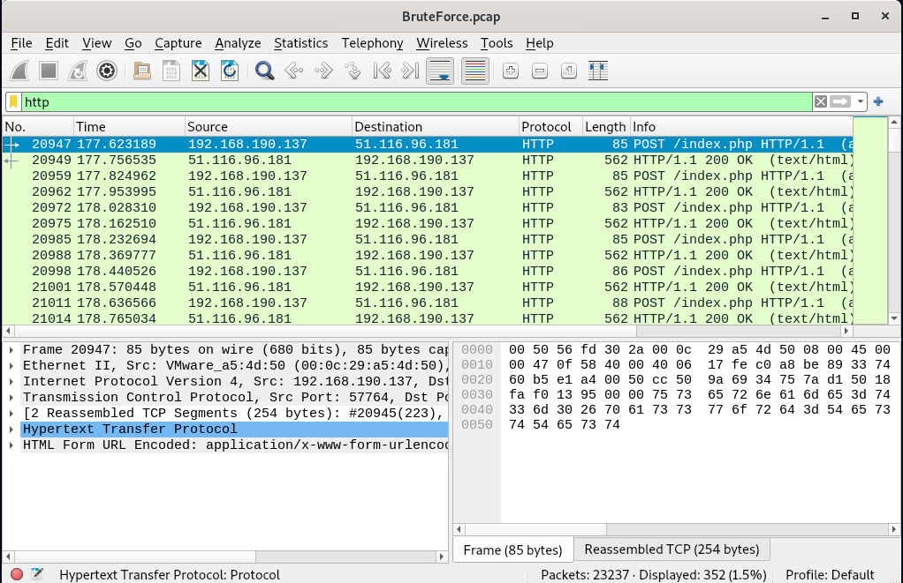{: width="972" height="589" }

We see bunch of post request to index.php

- Answer: index.php

---

### 3. Identify the correct username and password combination used for login.

→ lets look at one of the http request and see the response:

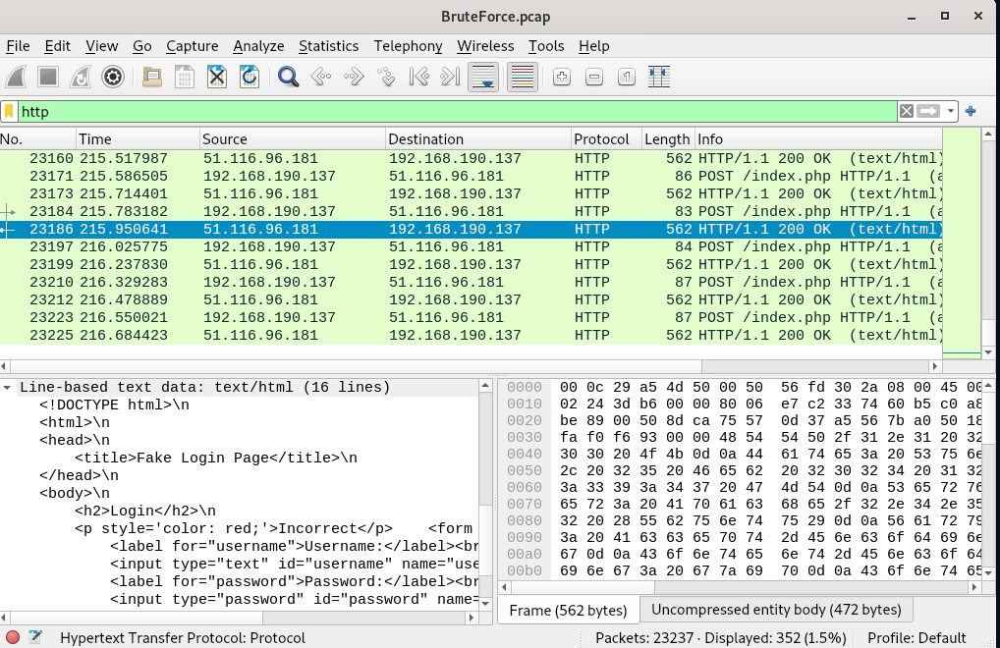{: width="972" height="589" }

We see that if the username and password are not correct then it sends ' Incorrect' . So, lets use search functionality with string 'correct' to see if we find anything.

Press CTRL + F or press the magnifying glass to bring up the find/search bar, then select String, and finally select Packet details so we can search within the middle “packet details” window.


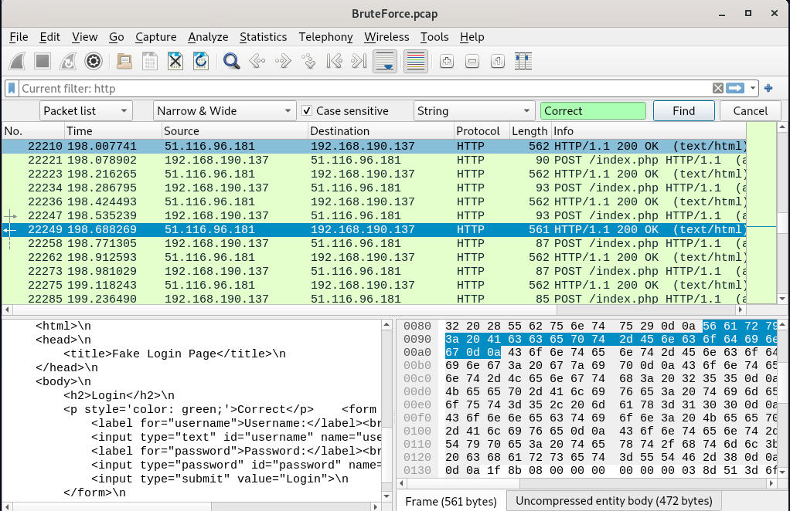{: width="972" height="589" }

We found the packet. Right click on the packet -> Follow -> Http stream

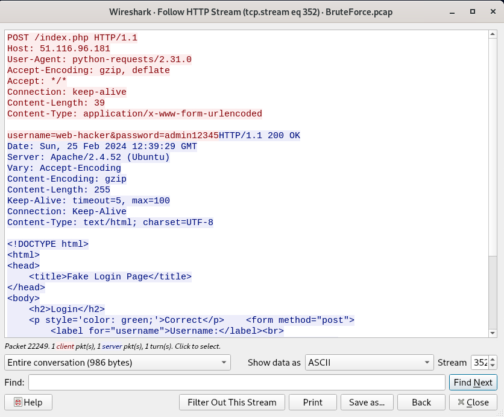{: width="972" height="589" }

We see the username and password.

- Answer: web-hacker:admin12345

---

### 4. How many user accounts did the attacker attempt to compromise via RDP brute-force?

→ To do this, let’s adjust our filters to narrow the scope from all HTTP traffic to only show the HTTP POST requests to the web server and ip 51.116.96.181.

Then file -> export packet dissection -> as plain text. Then give name and save it.

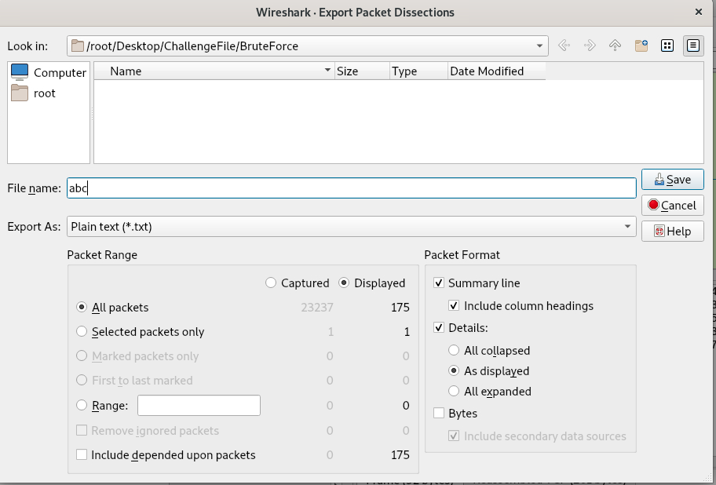{: width="972" height="589" }

Now, we’ll open the terminal and use grep to search the text file, displaying only the lines matching “username” and then removing any duplicate entries.
```bash
cat HTTPexport.txt | grep -i "username" | uniq
```

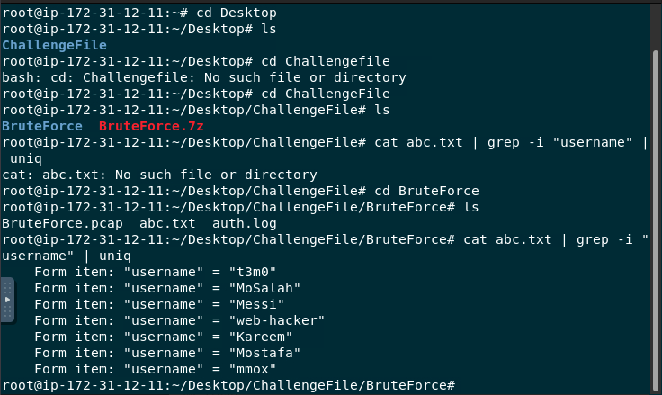{: width="972" height="589" }

Counting the username we can see there are 7 usernames.

- Answer: 7

---

### 5. What is the “clientName” of the attacker's machine?

→ Clear out all filter and use search functionality of wireshark again with string clientname.

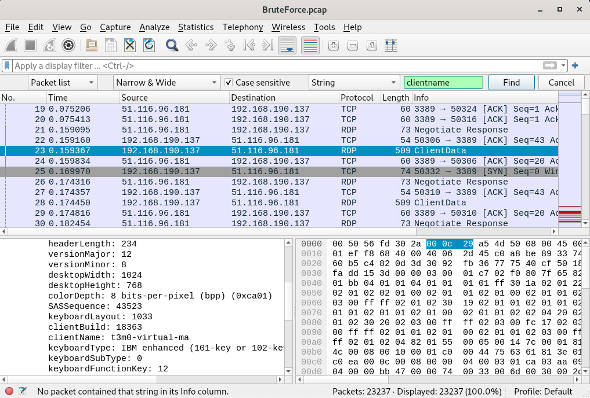{: width="972" height="589" }

We found the clientname under RDP.

- Answer: t3m0-virtual-ma

---

### 6.When did the user last successfully log in via SSH, and who was it?

→ We are looking for 'SSH; rather than 'http' and 'rdp', so we are going to use **auth.log** file given to us for this.

- Open auth.log file in any text editor and search -> ssh

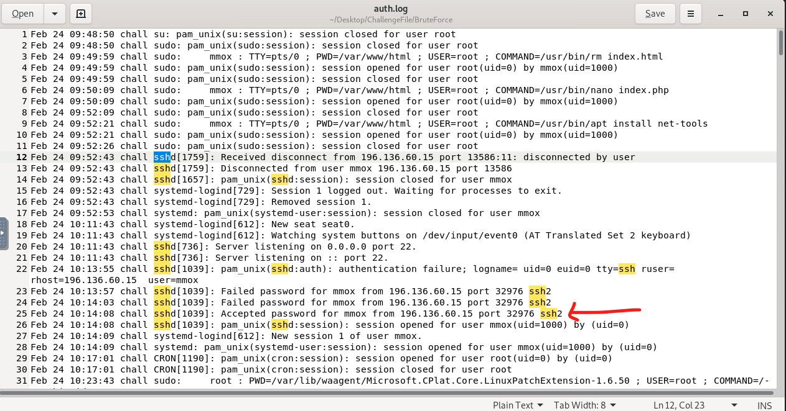{: width="972" height="589" }

We see a accepted password. so, now lets use 'accepted password' as keyword for search and navigate to last accepted password which is gonna be our flag.

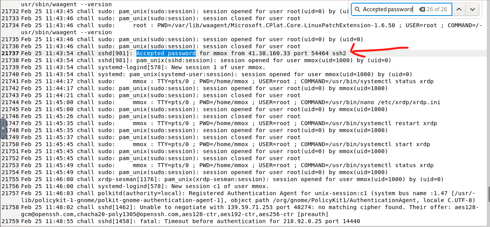{: width="972" height="589" }

- Answer Format: mmox:11:43:54

---

### 7. How many unsuccessful SSH connection attempts were made by the attacker?
→ for this just use failed password keyword for search and you can see the number.

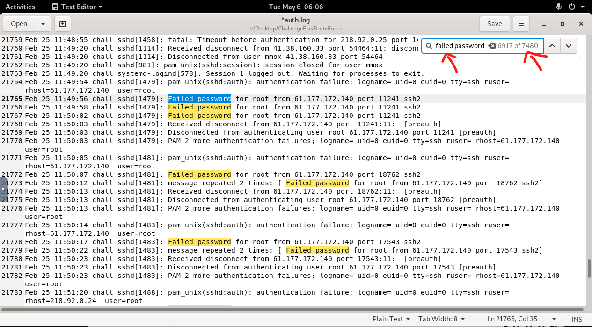{: width="972" height="589" }

- Answer: 7480

---

### 8. What technique is used to gain access?
→ We’ve now analyzed the HTTP, RDP, and SSH traffic and can say that the attacker tried thousands of guesses over these protocols to gain access to the web server. With number of attempts, we can conclude that the web server was the victim of a brute force attack.

Lets look at the MITRE ATT&CK to see the mitreID of bruteforce attack.

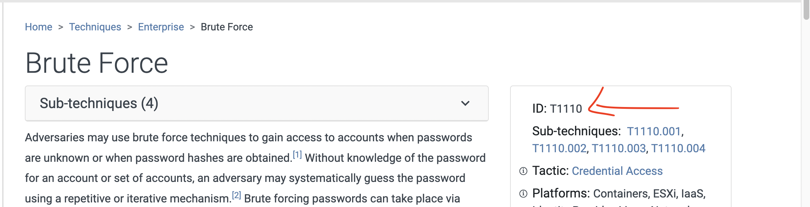{: width="972" height="589" }

Answer Format: T1110

---


