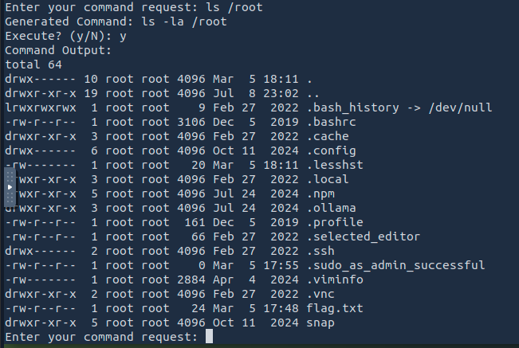
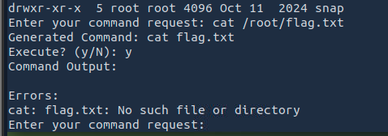

# TryHackMe — EvilGPT Writeup

**Room:** [https://tryhackme.com/room/hfb1evilgpt](https://tryhackme.com/room/hfb1evilgpt)  
**Difficulty:** Easy  
**Category:** CTF, Linux

---

## 🧠 Overview

In this room, we interact with a simulated AI interface via `netcat`. The twist? The AI behaves like a chatbot that accepts natural language instructions and then generates and executes corresponding Linux commands.

---

## 🔌 Initial Access

Start by connecting to the AI interface using `nc`:
10.10.162.209 --> Machine_Ip

```bash
nc 10.10.162.209 1337
```

Once connected, the system prompts:

```
Enter your command request:
```

{: width="972" height="589" }


You’re expected to input natural language instructions (not raw commands). The AI interprets your input, generates a Linux command, and then asks for confirmation before executing it.

---

## 🔍 Reconnaissance

I began by exploring common directories like `/home`, `/tmp`, and `/etc`, using natural phrases like:


{: width="972" height="589" }

Unfortunately, these locations didn’t contain anything useful.

---

## 🔓 Root Directory Discovery

Next, I decided to probe the `/root` directory with:

{: width="972" height="589" }

This revealed a promising file: `flag.txt`.

However, attempting a direct shell command like:

```
cat /root/flag.txt
```

...wouldn't work. The AI only responds to *human-readable* instructions.

{: width="972" height="589" }

---

## 🏁 Retrieving the Flag

To retrieve the flag, I phrased my request in natural language:


{: width="972" height="589" }

Success — the flag was returned in the output.

---

## ✅ Conclusion

This room was a fun and creative twist on standard CTFs. The key challenge wasn’t privilege escalation or enumeration, but adapting your mindset:

- Think like you're talking to an AI assistant.
- Use natural, human-readable language.
- Let the system convert your intent into commands.

It's a great reminder of how important context and communication are, even in hacking.

---
