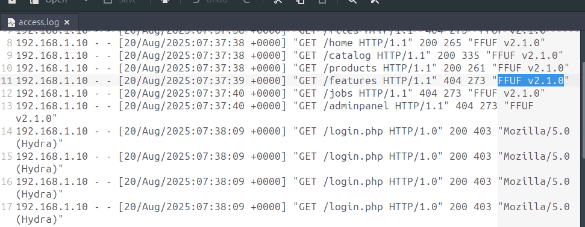
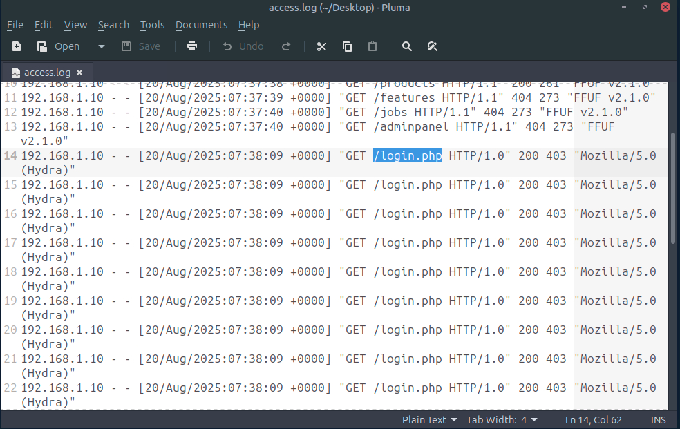
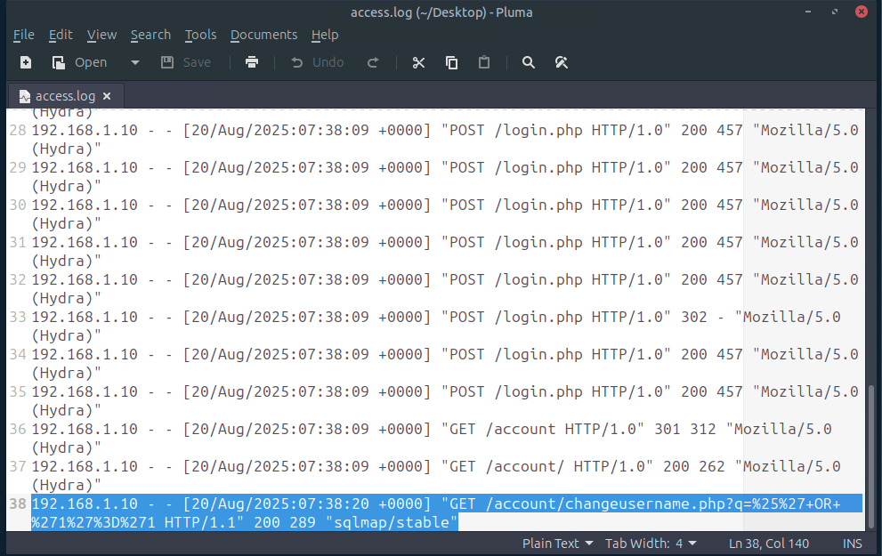
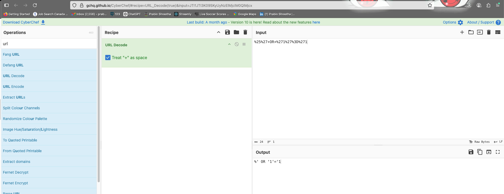
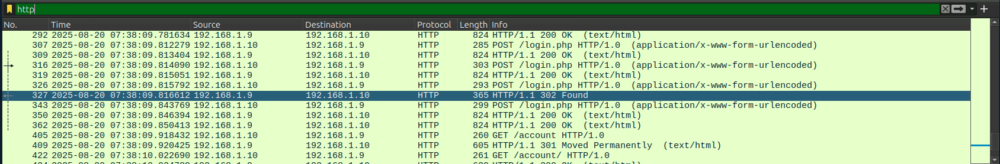
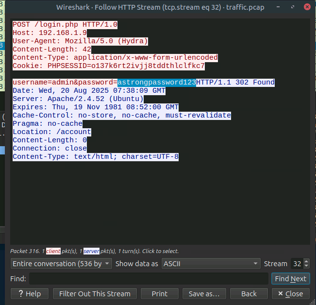
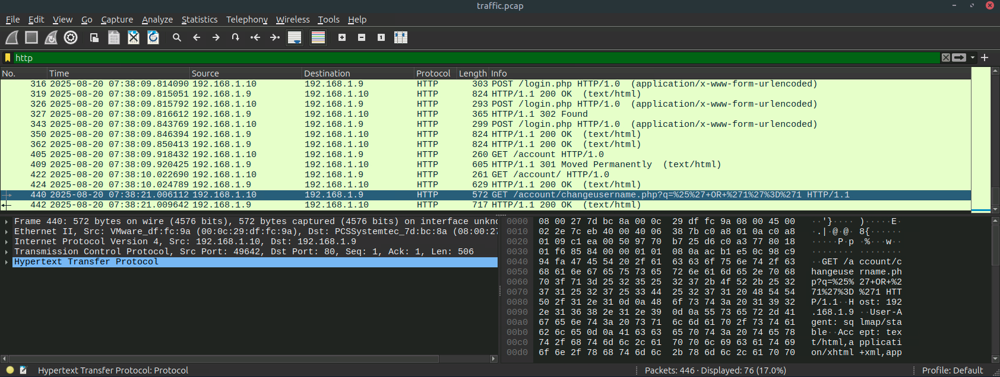
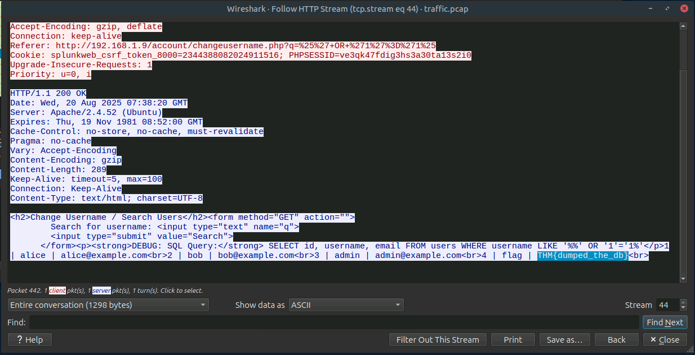

# 

## Objectives
- Learn common client-side and server-side attack types  
- Understand the benefits and limitations of log-based detection  
- Explore network traffic–based detection methods  
- Understand how and why Web Application Firewalls are used  
- Practice identifying common web attacks using the methods covered  

We are given `access.log` and `traffic.pcap` files to analyse and answer the questions in this lab.

---

## Task 2: Client-Side Attacks
**Q:** What class of attacks relies on exploiting the user’s behavior or device?  
**A:** Client-Side  

**Q:** What is the most common client-side attack?  
**A:** XSS  

---

## Task 3: Server-Side Attacks
**Q:** What class of attacks relies on exploiting vulnerabilities within web servers?  
**A:** Server-Side  

**Q:** Which server-side attack lets attackers abuse forms to dump database contents?  
**A:** SQLi  

---

## Task 4: Log-Based Detection
**Q:** What is the attacker’s User-Agent while performing the directory fuzz?  
**A:** FFUF v2.1.0  

  {: width="972" height="589" }

**Q:** What is the name of the page on which the attacker performs a brute-force attack?  

 - We see hydra being use for bruteforce at /login.php 
{: width="972" height="589" }

**A:** `/login.php` 


**Q:** What is the complete, decoded SQLi payload the attacker uses on the `/changeusername.php` form?  

{: width="972" height="589" }

- Lets decode he sqli payload with cyberchef
{: width="972" height="589" }

**A:** `%’ OR ‘1’=’1`  
---

## Task 5: Network-Based Detection
**Q:** What password does the attacker successfully identify in the brute-force attack?  
 
 - Open traffic.pcap
 - Filter by just http request
 - Scroll down and you will see 302 Found

{: width="972" height="589" }

- Right Click on it --> Follow --> HTTP STREAM

{: width="972" height="589" }

**A:** `astrongpassword123` 

**Q:** What is the flag the attacker found in the database using SQLi?  

 - Filter by just http stream again
 - Scroll down and you will see packet with sqli payload from before

 {: width="972" height="589" }

 - Right Click on it --> Follow --> HTTP STREAM

{: width="972" height="589" }

**A:** `THM{dumped_the_db}` 
---

## Task 6: Web Application Firewall
**Q:** What do WAFs inspect and filter?  
**A:** Web requests  

**Q:** Create a custom firewall rule to block any User-Agent that matches "BotTHM".  
**A:**
```txt
IF User-Agent CONTAINS "BotTHM" THEN block
```

---

## Conclusion
In this room, you learned about detecting web attacks, starting with a refresher on common client-side and server-side attacks. You then covered log-based analysis, followed by network traffic analysis, in order to understand common indicators and how to spot them as an analyst. Finally, we explored Web Application Firewalls and the rules used to defend against malicious web requests. By applying correlation across these sources, you can move beyond isolated alerts and develop a more well-rounded approach to detecting and responding to web attacks.
