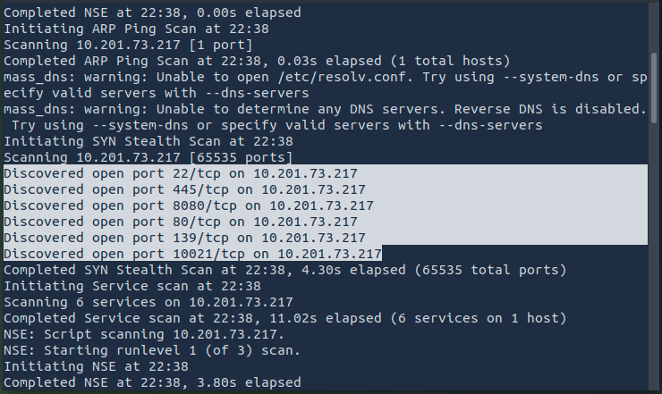

## Introduction
In this post I’ll walk you through my experience solving the **NET SEC CHALLENGE** room on TryHackMe. This room is perfect for beginners and teaches how computers communicate and how attackers might exploit network weaknesses.


---

## Tools Used
- **Nmap** — scanning and enumeration
- **Hydra** — brute-force cracking for FTP credentials (used only against the lab machine)
- `ftp` client — simple FTP interaction

---

## 🧩 Summary / Room Breakdown
This walkthrough shows the main commands and thought process I used to enumerate services and gain the flags for the room.

### Initial reconnaissance — single-line Nmap
I used a compact, aggressive scan that enumerates versions and runs default NSE scripts across all TCP ports:

```bash
nmap -sC -sV -p- -T4 <MACHINE_IP> -vv
```
  {: width="972" height="589" }
---

## Enumeration notes & quick wins
- The Nmap output listed open ports and service versions.

  {: width="972" height="589" }

  {: width="972" height="589" }

  {: width="972" height="589" }

  {: width="972" height="589" }
---

## Cracking FTP credentials
the next step was to try password cracking for FTP using Hydra (only run in the lab environment).

### Prepare username list
I moved the two discovered usernames into a file called `users.txt`:
  
  {: width="972" height="589" }

  {: width="972" height="589" }
### Hydra command used (lab)
This is the command I used to try to crack the two accounts against the FTP service on port `10021`: This will take time especially if your are doing in attackbox. my machine expired lol.

```bash
hydra -t 64 -L users.txt -P /usr/share/wordlists/rockyou.txt ftp:<Machine_ip>:10021
```
  {: width="972" height="589" }

> Reminder: Only run brute-force tools against systems you own or have explicit permission to test.

---

## Using the found credentials (FTP)
After Hydra returned valid credentials I connected to the FTP server and enumerated the filesystem:

I used `ls -la` (since `find`/`locate` are not available inside FTP sessions) to locate the `ftp_flag.txt` file and then downloaded it to the AttackBox.
Try on both user:

  {: width="972" height="589" }

  {: width="972" height="589" }
  
  {: width="972" height="589" }


---

##  Web challenge
The room included a small web challenge requiring stealth scan.

- Just open <machine_ip>:8080 url on your browser
- Run stealth nmap scan

  {: width="972" height="589" }

 {: width="972" height="589" }

- here comes the flag
---

## Conclusion
Congratulations. In this module, we have learned about passive reconnaissance, active reconnaissance, Nmap, protocols and services, and attacking logins with Hydra.

---

