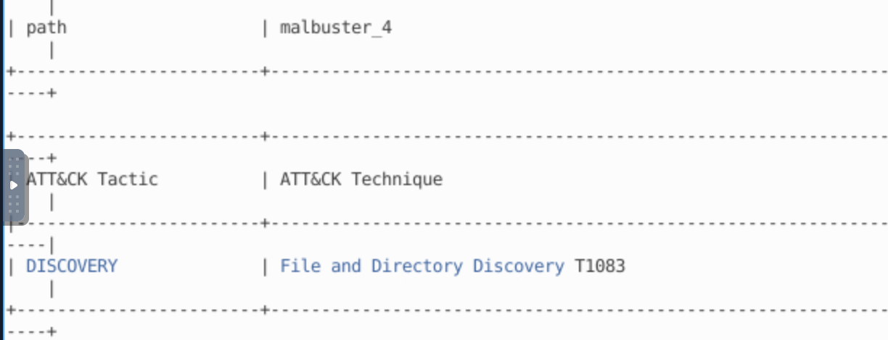

# Malbuster Practice Room — Walkthrough

This room aims to be a practice room for Dissecting PE Headers and Static Analysis 1. In this scenario, you will act as one of the Reverse Engineers that will analyse malware samples based on the detections reported by your SOC team.

# Scenario

You are currently working as a Malware Reverse Engineer for your organisation. Your team acts as a support for the SOC team when detections of unknown binaries occur. One of the SOC analysts triaged an alert triggered by binaries with unusual behaviour. Your task is to analyse the binaries detected by your SOC team and provide enough information to assist them in remediating the threat.

Lastly, you may find the malware samples on C:\Users\Administrator\Desktop\Samples. 

{: width="972" height="589" }

Q 1 Based on the ARCHITECTURE of the binary, is malbuster_1 a 32-bit or a 64-bit application? (32-bit/64-bit)

  {: width="972" height="589" }

**Answer — 32-bit**

---

Q 2 What is the MD5 hash of malbuster_1?

Using the md5sum command to get the md5 hash of the file

{: width="972" height="589" }

**Answer — 4348da65e4aeae6472c7f97d6dd8ad8f**

---

Q 3 Using the hash, what is the popular threat label of malbuster_1 according to VirusTotal?

Search with the md5 hash of the malbuster_1 sample on VirusTotal website 

Link — https://www.virustotal.com/

{: width="972" height="589" }

**Answer — trojan.zbot/razy**

---

Q 4 Based on VirusTotal detection, what is the malware signature of malbuster_2 according to Avira?

Get the md5 hash of the malwarebuster_2 malware sample 
{: width="972" height="589" }

Search with the hash on the VirusTotal website
Link — https://www.virustotal.com/

{: width="972" height="589" }

**Answer — HEUR/AGEN.1306860**

---

Q 5 malbuster_2 imports the function _CorExeMain. From which DLL file does it import this function?

Using pe-tree to disect the PE Header of the windows executable file

``` bash
pe-tree malwarebuster_2
```
{: width="972" height="589" }

**Answer — mscoree.dll**

---

Q 6 Based on the VS_VERSION_INFO header, what is the original name of malbuster_2?

{: width="972" height="589" }

**Answer — 7JYpE.exe**

---

Q 7 Using the hash of malbuster_3, what is its malware signature based on abuse.ch?

- Get the md5sum of malbuster_3

{: width="972" height="589" }

- Search the hash on abuse.ch with following query.
- abuse.ch link --> https://bazaar.abuse.ch/browse/

```bash
md5:47ba62ce119f28a55f90243a4dd8d324
```

{: width="972" height="589" }
**Answer — TrickBot**

---

Q 8 Using the hash of malbuster_4, what is its malware signature based on abuse.ch?

- Get md5sum

- Search the hash on abuse.ch with following query.
- abuse.ch link --> https://bazaar.abuse.ch/browse/

```bash
md5:061057161259e3df7d12dccb363e56f9
```

{: width="972" height="589" }

**Answer — Zloader**

---

Q 9 What is the message found in the DOS_STUB of malbuster_4?

$ pe-tree malbuster_4

{: width="972" height="589" }

**Answer — !This Salfram cannot be run in DOS mode.**

---

Q 10 malbuster_4 imports the function ShellExecuteA. From which DLL file does it import this function?

```bash
pe-tree malbuster_4
```

{: width="972" height="589" }

**Answer — shell32.dll**

---

Q 11 Using capa, how many anti-VM instructions were identified in malbuster_1?

- use the script
```bash
 capa malbuster_1
``` 

**Answer — 3**

---

Q 12 Using capa, which binary can log keystrokes?
- use capa to check each binary file
- malbuster_3 has followin ARR&CK Tactic

{: width="972" height="589" }


**Answer — malbuster_3**

---

Q 13 Using capa, what is the MITRE ID of the DISCOVERY technique used by malbuster_4?

{: width="972" height="589" }

**Answer — T1083**

---

Q 14 Which binary contains the string GodMode?

Using strings to extract the strings from the binary followed by grep with the ‘-i’ option to grep any strings with the value of God regardless wether it is uppercase or lowercase

```bash
strings malbuster_2 | grep -i 'god'
```

{: width="972" height="589" }


**Answer — malbuster_2**

---

Q 15 Which binary contains the string Mozilla/4.0 (compatible; MSIE 6.0; Windows NT 5.1; SV1)?
```bash
strings malbuster_1 | grep -i 'mozilla'
```
{: width="972" height="589" }


**Answer — malbuster_1**

---

## Conclusion

Through this practice room, we analyzed multiple Windows executables (malbuster_1 to malbuster_4) using static analysis techniques, PE header dissection, and threat intelligence lookups. Tools like `file`, `md5sum`, `pe-tree`, `strings`, and `capa` helped us uncover key details such as architecture, imports, embedded strings, anti-VM techniques, and original file metadata. By correlating hashes with VirusTotal and abuse.ch, we identified malware families including TrickBot and Zloader.  

This exercise demonstrates how combining static analysis with external threat intelligence provides a more complete understanding of malware behavior and attribution.

---

## Learning Outcomes

- Gained practical experience in **dissecting PE headers** to identify metadata, imports, and version info.  
- Learned how to use **hashing and online platforms (VirusTotal, abuse.ch)** for malware signature detection.  
- Practiced extracting and analyzing **strings** to uncover hidden messages, user-agent strings, and possible indicators of compromise.  
- Understood how to use **capa** for mapping binary capabilities to **MITRE ATT&CK techniques**.  
- Improved the workflow of combining **static analysis with threat intelligence** to strengthen malware investigation skills.  