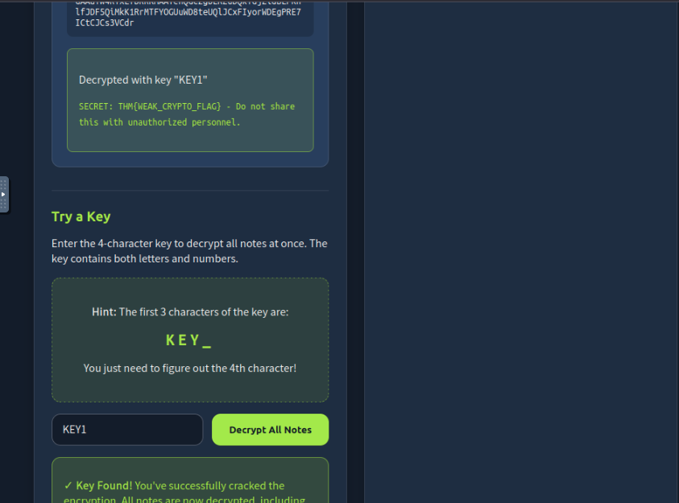
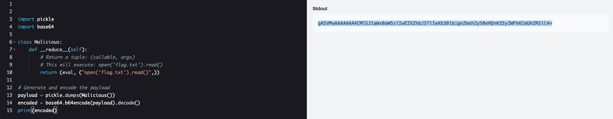
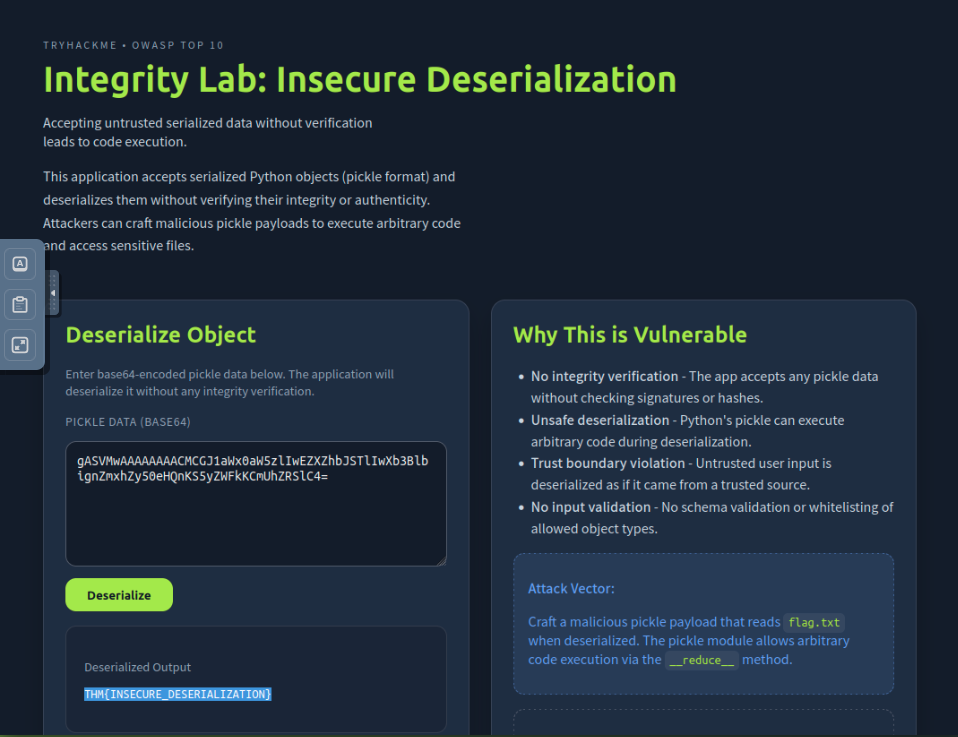
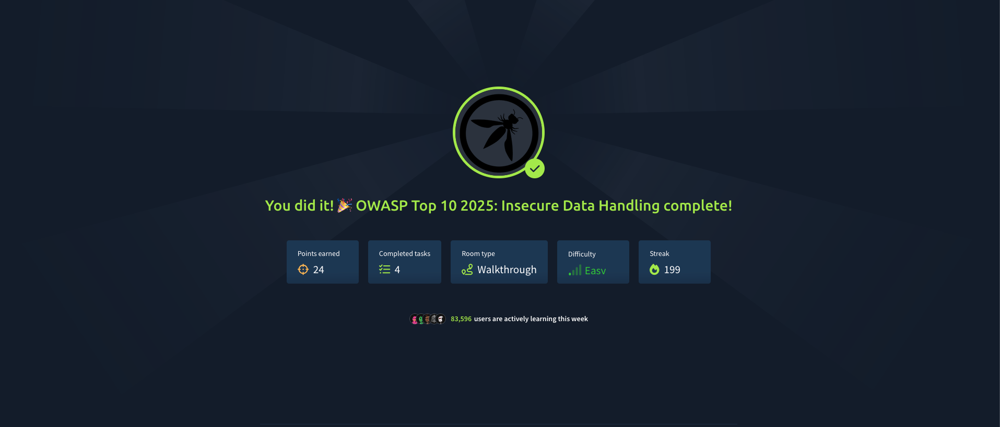

# OWASP Top 10 (2025) – Cryptographic Failures, Injection & Software/Data Integrity Failures  
### TryHackMe Room Write-up

---

## 🔐 A04: Cryptographic Failures

### Introduction
Cryptographic failures make yet another appearance on the OWASP Top 10 (2025) list. This category covers weaknesses in protecting sensitive data due to improper or insufficient use of cryptography.

---

### What Are Cryptographic Failures?

Cryptographic failures occur when sensitive data isn’t properly secured due to:

- Missing or weak encryption  
- Faulty implementations  
- Storing passwords without hashing  
- Using outdated algorithms (MD5, SHA1, DES)  
- Exposing encryption keys  
- Failing to secure data during transmission  
- “Rolling your own crypto” instead of using vetted libraries  

A common example is an application implementing homemade encryption rather than using established, secure algorithms.

---

### How to Prevent Cryptographic Failures

To avoid cryptographic failures:

- Use strong, modern cryptographic algorithms  
- Hash passwords using **bcrypt**, **scrypt**, or **Argon2**  
- Never hardcode credentials in code or configuration files  
- Use secure secret-management systems  
- Encrypt data in transit and at rest  
- Avoid building your own encryption system  

---

### Practical

Access the practical at:

```
http://MACHINE_IP:8001
```

This web app demonstrates a note-sharing service that uses a weak, shared derived key. Follow the steps on the provided interface to decrypt all notes.

---

{: width="972" height="589" }


### **Answer**
```
THM{WEAK_CRYPTO_FLAG}
```

---

## 💉 A05: Injection

### Introduction
Injection attacks remain one of the most common and dangerous vulnerabilities in web applications. OWASP continues to list it due to its prevalence and high impact.

---

### What Is Injection?

Injection occurs when user input is improperly handled and passed directly into systems that interpret commands—such as:

- Databases (**SQL Injection**)  
- Shell commands (**Command Injection**)  
- Template engines (**SSTI**)  
- AI/LLM prompts  
- APIs or file parsers  

This typically happens when an application constructs queries or commands using untrusted input.

---

### How to Prevent Injection

To mitigate injection attacks:

- Always treat user input as untrusted  
- Use **prepared statements** and **parameterized queries**  
- Avoid concatenating user input into commands  
- Use safe APIs that do not invoke system shells  
- Validate and sanitize all input  
- Enforce strict data types and filtering  

---

### Practical

This practical focuses on **Server-Side Template Injection (SSTI)**.

Access the challenge at:

```
http://MACHINE_IP:8000
```

Abuse SSTI to read the contents of `flag.txt` in the same directory as the application.

---

{: width="972" height="589" }

{: width="972" height="589" }

### **Answer**

```
THM{SSTI_FLAG_OBTAINED}
```

---

## 🧩 A08: Software or Data Integrity Failures

### Introduction
Software or Data Integrity Failures appear again on the OWASP Top 10 due to recurring issues with unverified updates, unsafe deserialization, and trusting unvalidated external sources.

---

### What Are Software or Data Integrity Failures?

These failures occur when applications trust code or data without verifying its:

- Source  
- Authenticity  
- Integrity  

Examples include:

- Accepting unverified updates  
- Loading scripts from untrusted sources  
- Not verifying configuration files or templates  
- Unsafe deserialization (Python pickle, PHP unserialize, Java deserialization)  

---

### How to Prevent Software & Data Integrity Failures

- Verify authenticity of updates using cryptographic signatures  
- Enforce trust boundaries  
- Validate data that impacts application logic  
- Avoid insecure deserialization—use safe formats like JSON  
- Harden CI/CD pipelines  
- Implement integrity checks on critical assets  

---

### Practical

This practical demonstrates an **insecure Python deserialization attack**.

Access it here:

```
http://MACHINE_IP:8002
```

Use Python to craft a malicious pickled payload that reads `flag.txt` and sends it to the target application.

---

{: width="972" height="589" }

### **Answer**

```
THM{INSECURE_DESERIALIZATION}
```

---

