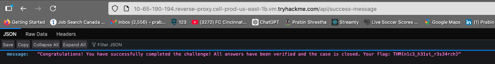
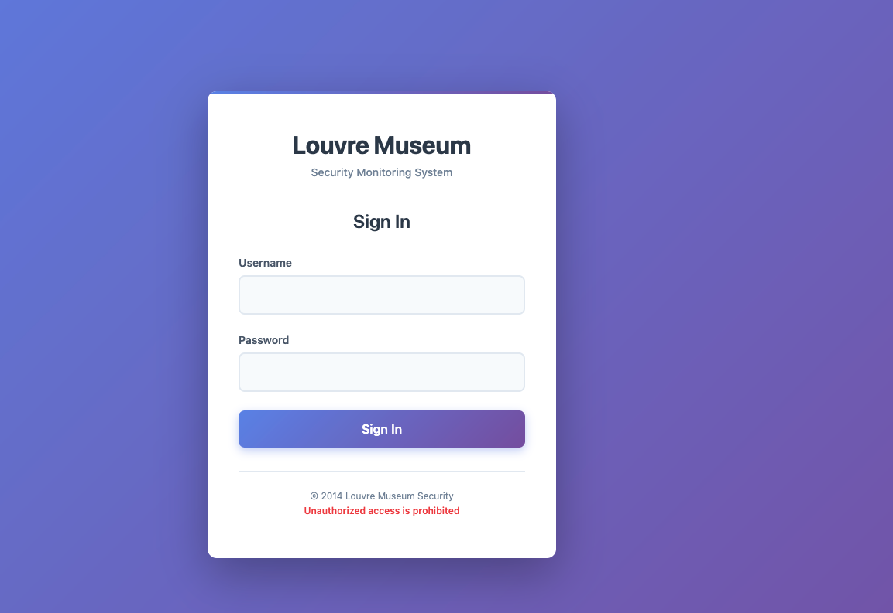
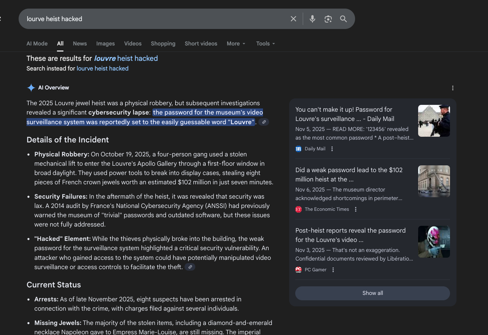
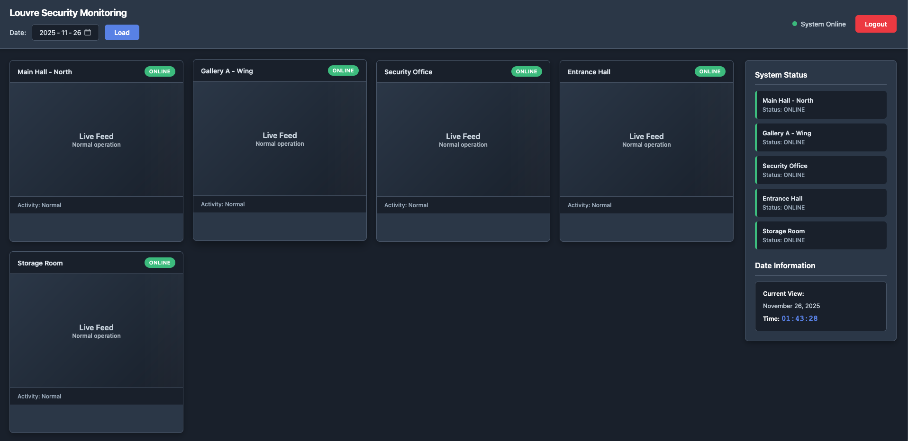
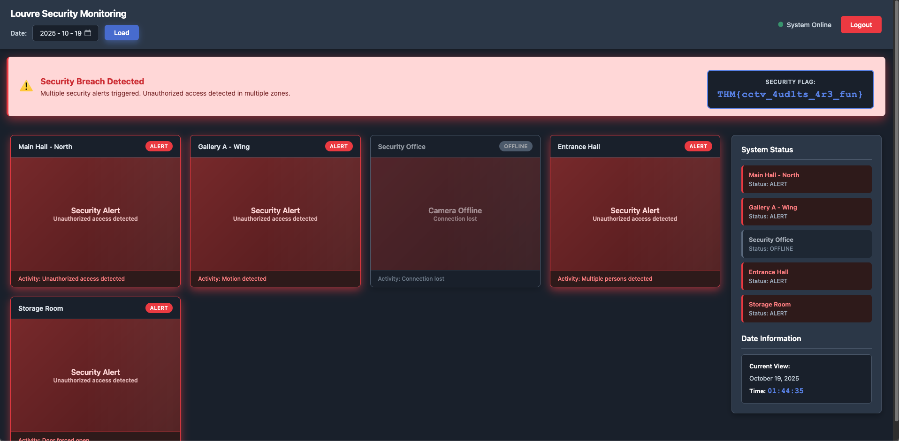

## Task 1 – Seine Incident 
###  What is the value of the flag?

Something audacious unfolded beneath the glass pyramid.

In the early hours, a crew in hi-vis vests breached the Galerie d'Apollon inside the Louvre. Security feeds went dark, and seven minutes later, the team disappeared toward the river.

You are the first analyst on call. Your mission is to reconstruct the details of the heist using open-source intelligence and online reports. The museum is under pressure, international alerts are spreading, and the press is already digging for answers.

Gather and verify information from public sources: museum pages, heritage archives, news coverage, social media, and open databases.

### Step 1: Inspect the Web Application
Using **Ctrl+U** (or **Cmd+U** on macOS), I viewed the page’s source code. Several API endpoints were listed:

- `/api/questions`  
- `/api/submit-answer`  
- `/api/submit-report`  
- `/api/success-message`  

manually browse them.

### Step 2: Access `/api/success-message`
Navigating directly to:

```
<LAB_URL>/api/success-message
```

Displayed the hidden message containing the first flag.

{: width="972" height="589" }

### 🏁 Task 1 Flag
```
THM{n1c3_h31st_r3s34rch}
```

---

## Task 2 – Louvre Protocol
###  What is the value of the flag?

The challenge text mentions a news report about an earlier audit of the Louvre’s surveillance systems, highlighting:

- outdated servers  
- inconsistent camera coverage  
- a weak password policy  

This is a clear hint that the login credentials are based on **weak, guessable passwords** referenced in public sources.


acessing the machine give you the following web page:

{: width="972" height="589" }

###  Step 1: Attempt Login Using OSINT
Following the hint, I researched “Louvre heist” and similar phrasing. Reports referenced poor credential practices, notably the repeated use of:

{: width="972" height="589" }

- Tried mixing matching username with password louvre. Following was success:

**Username:** `louvre`  
**Password:** `louvre`

This successfully logged into the CCTV portal.

{: width="972" height="589" }

###  Step 2: Identify the Correct Date
- The google search earlier also mentioned the date of heist.

**October 19, 2025**

apply date filter for that day.

###  Step 3: Retrieve Footage Flag
Once the correct date was selected, the system displayed the second flag.

{: width="972" height="589" }

### 🏁 Task 2 Flag
```
THM{cctv_4ud1ts_4r3_fun}
```

---

# 🎉 Summary

| Task | Description | Flag |
|------|-------------|------|
| **1** | OSINT + endpoint discovery | `THM{n1c3_h31st_r3s34rch}` |
| **2** | Weak credential audit + CCTV review | `THM{cctv_4ud1ts_4r3_fun}` |

You successfully completed both parts of the challenge by combining source inspection, OSINT enumeration, weak password exploitation, and system analysis.
