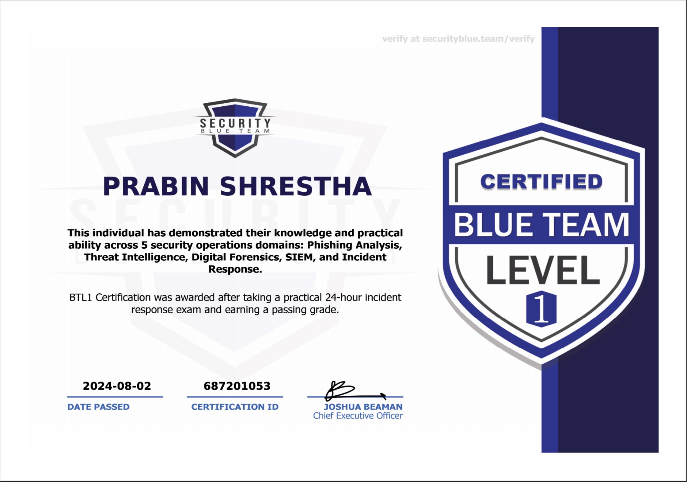
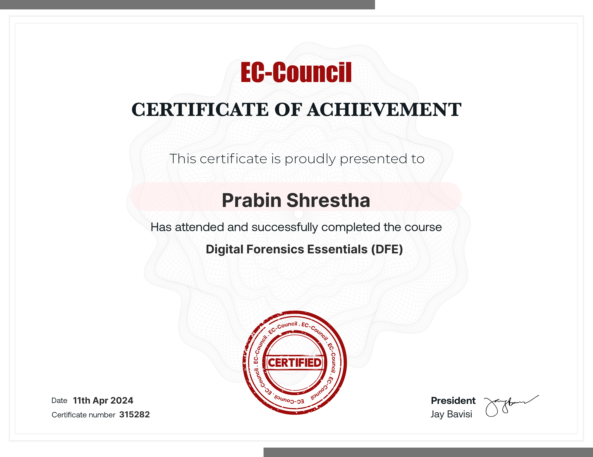
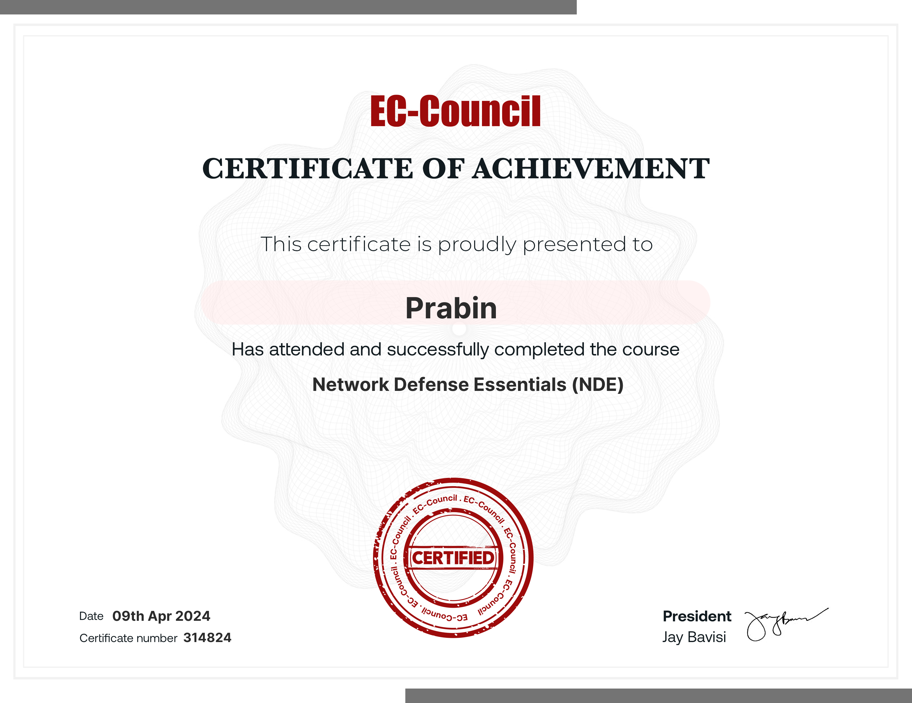
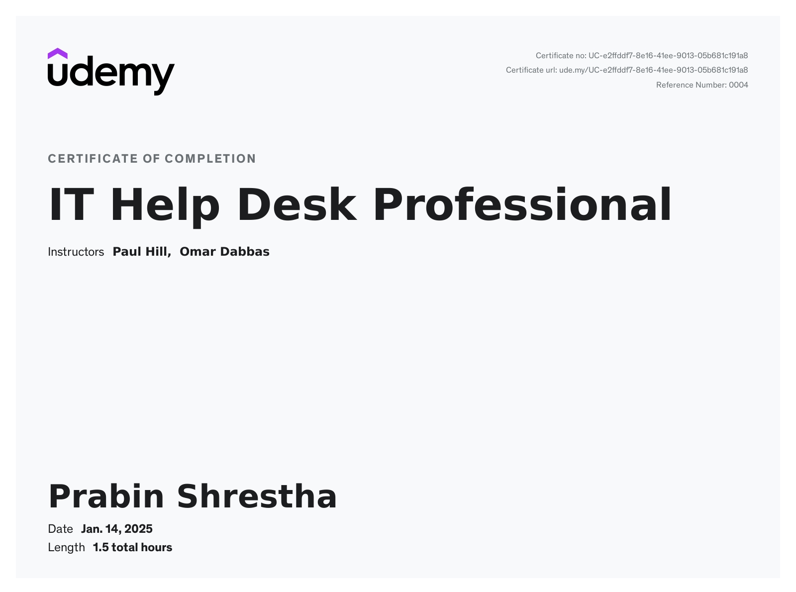
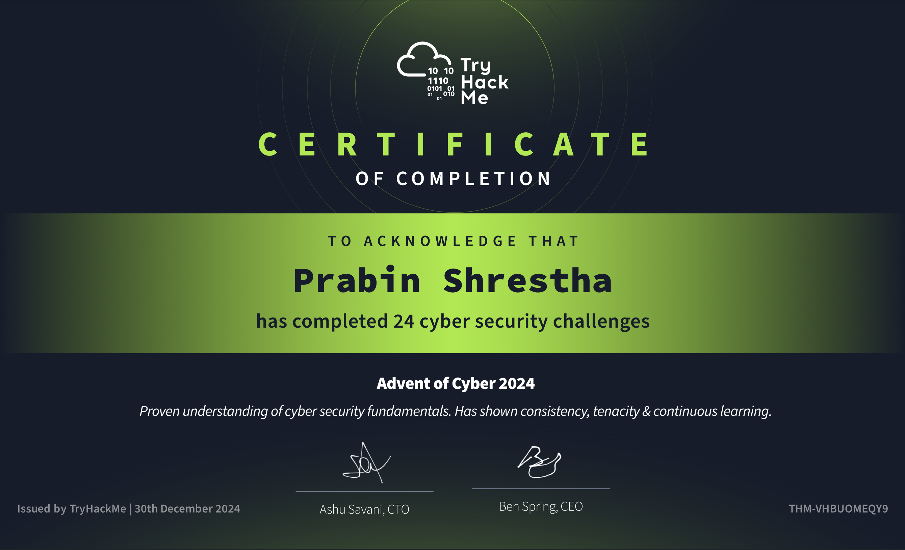
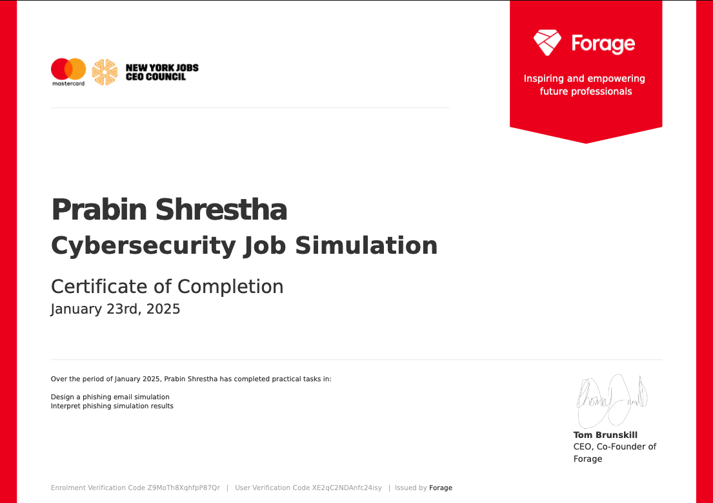

## 1. [BLUE TEAM LEVEL 1 (SECURITY BLUE TEAM)](https://www.credly.com/badges/5a5c60fa-431c-435c-90ad-f17a53f4c029) 

{: width="972" height="589" }

## 2. [Digital Forensics Essentials (DFE)](https://codered.eccouncil.org/certificate/b8e58184-161e-4dba-bc49-d17d93d7583b?logged=true) 

{: width="972" height="589" }

## 3. [Network Defense Essentials (NDE)](https://codered.eccouncil.org/certificate/195797c0-765e-4509-8826-20b2c407fd06?logged=true) 

{: width="972" height="589" }

## 4. [IT Help Desk Professional](https://gale.udemy.com/certificate/UC-e2ffddf7-8e16-41ee-9013-05b681c191a8/) 

{: width="972" height="589" }

## 5. [Advent of Cyber 2024 by TryHackMe!](https://tryhackme.com/r/certificate/THM-VHBUOMEQY9) 

{: width="972" height="589" }

## 6. [Mastercard Cybersecurity]() 

{: width="972" height="589" }
